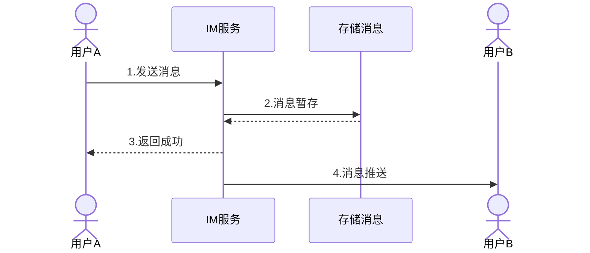
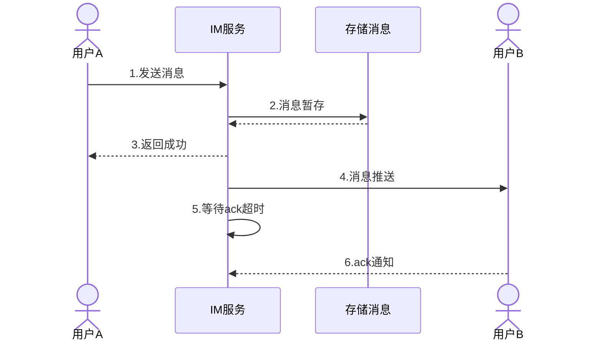
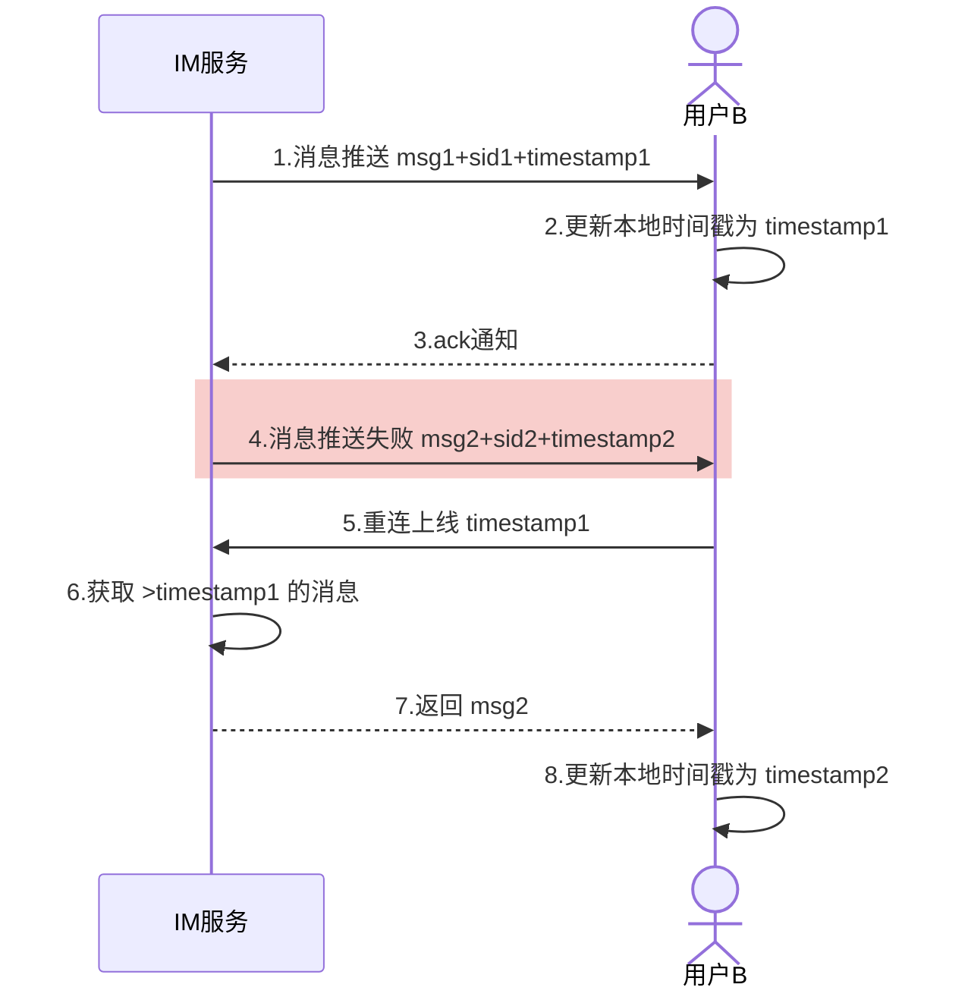

# 系统架构

# 可靠性

## 消息发送流程

发消息大概整体上分为两部分：
- 用户 A 发送消息到 IM 服务器，服务器将消息暂存，然后返回成功的结果给发送方 A（步骤 1、2、3）；
- IM 服务器接着再将暂存的用户 A 发出的消息，推送给接收方用户 B（步骤 4）。

## 消息丢失的情况
在第一部分中。步骤 1、2、3 都可能存在失败的情况。
+ 由于用户 A 发消息是一个“请求”和“响应”的过程，如果用户 A 在把消息发送到 IM 服务器的过程中，由于网络不通等原因失败了；
+ 或者 IM 服务器接收到消息进行服务端存储时失败了；
+ 或者用户 A 等待 IM 服务器一定的超时时间，但 IM 服务器一直没有返回结果，那么这些情况用户 A 都会被提示发送失败。

接下来，他可以通过重试等方式来弥补，注意这里可能会导致发送重复消息的问题。

在第二部分中。消息在 IM 服务器存储完后，响应用户 A 告知消息发送成功了，然后 IM 服务器把消息推送给用户 B 的在线设备。

在推送的准备阶段或者把消息写入到内核缓冲区后，如果服务端出现掉电，也会导致消息不能成功推送给用户 B。

即使我们的消息成功通过 TCP 连接给到用户 B 的设备，但如果用户 B 的设备在接收后的处理过程出现问题，也会导致消息丢失。比如：用户 B 的设备在把消息写入本地 DB 时，出现异常导致没能成功入库，这种情况下，由于网络层面实际上已经成功投递了，但用户 B 却看不到消息。

上面两种情况都可能导致消息丢失，那么怎么避免这些异常情况下丢消息的问题呢？  
一般我们会用下面这些相应的解决方案：
1. 针对第一部分，我们通过客户端 A 的超时重发和 IM 服务器的去重机制，基本就可以解决问题；   
2. 针对第二部分，业界一般参考 TCP 协议的 ACK 机制，实现一套业务层的 ACK 协议。

## 解决丢失的方案：业务层 ACK 机制
在 TCP 协议中，默认提供了 ACK 机制，通过一个协议自带的标准的 ACK 数据包，来对通信方接收的数据进行确认，告知通信发送方已经确认成功接收了数据。

那么，业务层 ACK 机制也是类似，解决的是：**IM 服务推送后如何确认消息是否成功送达接收方**。

IM 服务器在推送消息时，携带一个标识 SID（安全标识符，类似 TCP 的 sequenceId），推送出消息后会将当前消息添加到“待 ACK 消息列表”，客户端 B 成功接收完消息后，会给 IM 服务器回一个业务层的 ACK 包，包中携带有本条接收消息的 SID，IM 服务器接收后，会从“待 ACK 消息列表”记录中删除此条消息，本次推送才算真正结束。

### ACK 机制中的消息重传

如果消息推给用户 B 的过程中丢失了怎么办？比如：

- B 网络实际已经不可达，但 IM 服务器还没有感知到；
- 用户 B 的设备还没从内核缓冲区取完数据就崩溃了；
- 消息在中间网络途中被某些中间设备丢掉了，TCP 层还一直重传不成功等。

以上的问题都会导致用户 B 接收不到消息。

解决这个问题的常用策略其实也是参考了 TCP 协议的重传机制。类似的，IM 服务器的“等待 ACK 队列”一般都会维护一个超时计时器，一定时间内如果没有收到用户 B 回的 ACK 包，会从“等待 ACK 队列”中重新取出那条消息进行重推。

### 消息重复推送的问题

刚才提到，对于推送的消息，如果在一定时间内没有收到 ACK 包，就会触发服务端的重传。收不到 ACK 的情况有两种，除了推送的消息真正丢失导致用户 B 不回 ACK 外，还可能是用户 B 回的 ACK 包本身丢了。

对于第二种情况，ACK 包丢失导致的服务端重传，可能会让接收方收到重复推送的消息。

针对这种情况，一般的解决方案是：服务端推送消息时携带一个 Sequence ID，Sequence ID 在本次连接会话中需要唯一，针对同一条重推的消息 Sequence ID 不变，接收方根据这个唯一的 Sequence ID 来进行业务层的去重，这样经过去重后，对于用户 B 来说，看到的还是接收到一条消息，不影响使用体验。

## 这样真的就不会丢消息了吗？

通过“ACK+ 超时重传 + 去重”的组合机制，能解决大部分用户在线时消息推送丢失的问题，那是不是就能完全覆盖所有丢消息的场景呢？

设想一下，假设一台 IM 服务器在推送出消息后，由于硬件原因宕机了，这种情况下，如果这条消息真的丢了，由于负责的 IM 服务器宕机了无法触发重传，导致接收方 B 收不到这条消息。

这就存在一个问题，当用户 B 再次重连上线后，可能并不知道之前有一条消息丢失的情况。对于这种重传失效的情况该如何处理？

### 补救措施：消息完整性检查

针对服务器宕机可能导致的重传失效的问题在于：服务器机器宕机，重传这条路走不通了。

那如果在用户 B 在重新上线时，让服务端有能力进行完整性检查，发现用户 B“有消息丢失”的情况，就可以重新同步或者修复丢失的数据。

比较常见的消息完整性检查的实现机制有“时间戳比对”。

- IM 服务器给接收方 B 推送 msg1，顺便带上一个最新的时间戳 timestamp1，接收方 B 收到 msg1 后，更新本地最新消息的时间戳为 timestamp1。
- IM 服务器推送第二条消息 msg2，带上一个当前最新的时间戳 timestamp2，msg2 在推送过程中由于某种原因接收方 B 和 IM 服务器连接断开，导致 msg2 没有成功送达到接收方 B。
- 用户 B 重新连上线，携带本地最新的时间戳 timestamp1，IM 服务器将用户 B 暂存的消息中时间戳大于 timestamp1 的所有消息返回给用户 B，其中就包括之前没有成功的 msg2。
- 用户 B 收到 msg2 后，更新本地最新消息的时间戳为 timestamp2。

通过上面的时间戳机制，用户 B 可以成功地让丢失的 msg2 进行补偿发送。

需要说明的是，由于时间戳可能存在多机器时钟不同步的问题，所以可能存在一定的偏差，导致数据获取上不够精确。所以在实际的实现上，也可以使用全局的自增序列作为版本号来代替。

# 有序性
## 为什么保证消息的时序一致性很困难？

从理论上来说，保持消息的时序一致性貌似并不难。理论上，我们想象的消息收发场景中，只有单一的发送方、单一的接收方。

我们需要面对的是多发送方、多接收方、服务端多线程并发处理的情况。所以，知道了难点，我们再来看一看究竟在后端的工程实现上，保证消息的时序一致都存在哪些难点。

消息的时序一致性其实是要求我们的消息具备“时序可比较性”，也就是消息相对某一个共同的“时序基准”可以来进行比较，**所以，要保证消息的时序一致性的一个关键问题是：我们是否能找到这么一个时序基准，使得我们的消息具备“时序可比较性”。**

在工程实现上，我们可以分成这样几步。

- **首先是：如何找到时序基准。**
- **其次是：时序基准的可用性是不是可以。**
- **最后是：有了时序基准，还有其他的误差吗，有什么办法可以减少这些误差？**

## 如何找到时序基准？
**发送方的本地序号和本地时钟是否可以作为“时序基准”？**
不行。因为因为重装，手动调整设备时间，多设备登录等原因会导致序号和时钟回退。

**IM 服务器的本地时钟是否可以作为“时序基准”？**
IM 服务都是集群化部署，虽然多台服务器通过 NTP 时间同步服务，能降低服务集群机器间的时钟差异到毫秒级别，但仍然还是存在一定的时钟误差。
而且 IM 服务器规模相对比较大，时钟的统一性维护上也比较有挑战，整体时钟很难保持极低误差。

**既然单机本地化的时钟或者序号都存在问题，那么如果有一个全局的时钟或者序号，是不是就能解决这个问题了呢？我们来看看 IM 服务端如果有一个全局序号，是不是就可以作为“时序基准”。**

## 如何确保“时序基准”的可用性
使用“全局序号生成器”发出的序号，来作为消息排序的“时序基准”，能解决每一条消息没有标准“生产日期”的问题，但如果是面向高并发和需要保证高可用的场景，还需要考虑这个“全局序号生成器”的**可用性**问题。

+ 首先，类似 Redis 的原子自增和 DB 的自增 ID，都要求在主库上来执行“取号”操作，而主库基本都是单点部署，在可用性上的保障会相对较差，另外，针对高并发的取号操作这个单点的主库可能容易出现性能瓶颈。
+ 而采用类似 snowflake 算法的时间相关的分布式“序号生成器”也存在一些问题。一般只能到秒级或者毫秒级，存在时钟回拨问题。

> 从业务层面考虑，对于群聊和多点登陆这种场景，没有必要保证全局的跨多个群的绝对时序性，只需要保证某一个群的消息有序即可。
> 这样的话，如果可以针对每一个群有独立一个“ID 生成器”，能通过哈希规则把压力分散到多个主库实例上，大量降低多群共用一个“ID 生成器”的并发压力。

**对于大部分即时消息业务来说，产品层面可以接受消息时序上存在一定的细微误差。比如同一秒收到同一个群的多条消息，业务上是可以接受这一秒的多条消息，未严格按照“接收时的顺序”来排序的。实际上，这种细微误差对于用户来说，基本也是无感知的。**

那么，对于依赖“分布式的时间相关的 ID 生成器”生成的序号来进行排序，如果时间精度业务上可以接受，也是没问题的。

从之前微信对外的分享，我们可以了解到：微信的聊天和朋友圈的消息时序也是通过一个“递增”的版本号服务来进行实现的。不过这个版本号是每个用户独立空间的，保证递增，不保证连续。

微博的消息箱则是依赖“分布式的时间相关的 ID 生成器”来对私信、群聊等业务进行排序，目前的精度能保证秒间有序。

## 如何解决“时序基准”之外的其他误差
### 消息服务端包内整流

虽然大部分情况下，聊天、直播互动等即时消息业务能接受“小误差的消息乱序”，但某些特定场景下，可能需要 IM 服务能保证绝对的时序。

比如发送方的某一个行为同时触发了多条消息，而且这多条消息在业务层面需要严格按照触发的时序来投递。

一个例子：用户 A 给用户 B 发送最后一条分手消息同时勾上了“取关对方”的选项，这个时候可能会同时产生“发消息”和“取关”两条消息，如果服务端处理时，把“取关”这条信令消息先做了处理，就可能导致那条“发出的消息”由于“取关”了，发送失败的情况。

对于这种情况，我们一般可以调整实现方式，在发送方对多个请求进行业务层合并，多条消息合并成一条；也可以让发送方通过单发送线程和单 TCP 连接能保证两条消息有序到达。

但即使 IM 服务端接收时有序，由于多线程处理的原因，真正处理或者下推时还是可能出现时序错乱的问题，解决这种“需要保证多条消息绝对有序性”可以通过 IM 服务端包内整流来实现。

整个过程是这样的：
- 首先生产者为每个消息包生成一个 packageID，为包内的每条消息加个有序自增的 seqID；
- 其次消费者根据每条消息的 packageID 和 seqID 进行整流，最终执行模块只有在一定超时时间内完整有序地收到所有消息才执行最终操作，否则根据业务需要触发重试或者直接放弃操作。
服务端包内整流大概就是这个样子，我们要做的是在最终服务器取到 TCP 连接后下推的时候，根据包的 ID，对一定时间内的消息做一个整流和排序。

### 消息接收端整流

携带不同序号的消息到达接收端后，可能会出现“先产生的消息后到”“后产生的消息先到”等问题。消息接收端的整流就是解决这样的一个问题的，

消息客户端本地整流的方式可以根据具体业务的特点来实现，目前业界比较常见的实现方式也很简单，步骤如下：

1. 下推消息时，连同消息和序号一起推送给接收方；
2. 接收方收到消息后进行判定，如果当前消息序号大于前一条消息的序号，就将当前消息追加在会话里；
3. 否则继续往前查找倒数第二条、第三条等，一直查找到恰好小于当前推送消息的那条消息，然后插入在其后展示。

# 安全性

一般可以从三个维度来对安全性进行评价。

1. 消息传输安全性。“访问入口安全”和“传输链路安全”是基于互联网的即时消息场景下的重要防范点。针对“访问入口安全”可以通过 HttpDNS 来解决路由器被恶意篡改和运营商的 LocalDNS 问题；而 TLS 传输层加密协议是保证消息传输过程中被截获、篡改、伪造的常用手段。
    
2. 消息存储安全性。针对账号密码的存储安全可以通过“高强度单向散列算法”和“加盐”机制来提升加密密码可逆性；对于追求极致安全性的即时消息场景并且政策允许的情况下，服务端应该尽量不存储消息内容，并且采用“端到端加密”方式来提供更加安全的消息传输保护。
    
3. 消息内容安全性。针对消息内容的安全识别可以依托“敏感词库”“图片识别”“OCR 和语音转文字”“外链爬虫抓取分析”等多种手段，并且配合“联动惩罚处置”来进行风险识别的后置闭环。

# 未读提醒
## 会话未读和总未读单独维护

很多即时消息的“未读数”实现中，会话未读数和总未读数都是单独维护的。

原因在于“总未读”在很多业务场景里会被高频使用，比如每次消息推送需要把总未读带上用于角标未读展示。

另外，有些 App 内会通过定时轮询的方式来同步客户端和服务端的总未读数，比如微博的消息栏总未读不仅包括即时消息相关的消息数，还包括其他一些业务通知的未读数，所以通过消息推送到达后的累加来计算总未读，并不是很准确，而是换了另外一种方式，通过轮询来同步总未读。

对于高频使用的“总未读”，如果每次都通过聚合所有会话未读来获取，用户的互动会话不多的话，性能还可以保证；一旦会话数比较多，由于需要多次从存储获取，容易出现某些会话未读由于超时等原因没取到，导致总未读数计算少了。

而且，多次获取累加的操作在性能上比较容易出现瓶颈。所以，出于以上考虑，总未读数和会话未读数一般是单独维护的。

## 未读数的一致性问题

单独维护总未读和会话未读能解决总未读被“高频”访问的性能问题，但同时也会带来新的问题：未读数的一致性。

未读数一致性是指：**维护的总未读数和会话未读数的总和要保持一致**。如果两个未读数不能保持一致，就会出现“收到新消息，但角标和 App 里的消息栏没有未读提醒”，或者“有未读提醒，点进去找不到是哪个会话有新消息”的情况。

**案例原因：其实都是因为两个未读的变更不是原子性的，会出现某一个成功另一个失败的情况，也会出现由于并发更新导致操作被覆盖的情况。所以要解决这些问题，需要保证两个未读更新操作的原子性。**

## 保证未读更新的原子性
- **分布式锁**，具备较好普适性，但执行效率较差，锁的管理也比较复杂，适用于较小规模的即时消息场景；
- **支持事务功能的资源**，不需要额外的维护锁的资源，实现较为简单，但基于乐观锁的 watch 机制在较高并发场景下失败率较高，执行效率比较容易出现瓶颈；
- **原子化嵌入脚本**，不需要额外的维护锁的资源，高并发场景下性能也较好，嵌入脚本的开发需要一些额外的学习成本。

# 多终端漫游
## 离线消息同步的几个关键点

对于多终端同时在线的情况，实现上相对比较简单，只需要维护一套设备维度的在线状态就能同时推送多台设备。

而离线设备上线后拉取历史消息的过程就要复杂一些，比如，离线消息的存储和普通消息相比差别在哪？应该怎么存？每次上线怎么知道应该拉取哪些离线消息？

### 离线消息该怎么存？
一条消息在服务端存储一般会分为消息内容表和消息索引表，其中消息索引表是按照收发双方的会话维度来设计的，这样便于收发双方各自查看两人间的聊天内容。

首先，对于离线消息的存储，不仅仅需要存储消息，还需要存储一些操作的信令，比如：用户 A 在设备 1 删除了和用户 B 的某条消息，这个信令虽然不是一条消息，也需要在离线消息存储中存起来，这样当用户 A 的另一台设备 2 上线时，能通过离线消息存储获取这个删除消息的信令，从而在设备 2 上也能从本地删除那条消息。

对于这些操作信令，没有消息 ID 的概念和内容相关的信息，而且是一个一次性的动作，没必要持久化，也不适合复用消息索引表；另外，消息索引表是收发双方的会话维度，而获取离线消息的时候是接收方或者发送方的单个用户维度来获取数据的，没必要按会话来存，只需要按 UID 来存储即可。

此外，还有一个需要考虑的点，离线消息的存储成本是比较高的，而我们并不知道用户到底有几个设备，因此离线消息的存储一般都会有时效和条数的限制，比如保留 1 周时间，最多存储 1000 条，这样如果用户一台设备很久不登录然后某一天再上线，只能从离线消息存储中同步最近一周的历史聊天记录。

### 多端消息同步机制

离线消息的同步还有一个重要的问题是，由于并不知道用户到底会有多少个终端来离线获取消息，我们在一个终端同步完离线消息后，并不会从离线存储中删除这些消息，而是继续保留以免后续还有该用户的其他设备上线拉取，离线消息的存储也是在不超过大小限制和时效限制的前提下，采用 FIFO（先进先出）的淘汰机制。

这样的话用户在使用某一个终端登录上线时，需要知道应该获取哪些离线消息，否则将所有离线都打包推下去，就会造成两种问题：一个是浪费流量资源；另外可能会导致因为有很多消息在终端中已经存在了，全部下推反而会导致消息重复出现和信令被重复执行的问题。因此，需要一个机制来保证离线消息可以做到按需拉取。

一种常见的方案是采用版本号来实现多终端和服务端的数据同步。下面简单说一下版本号的概念。

- 每个用户拥有一套自己的版本号序列空间。
- 每个版本号在该用户的序列空间都具备唯一性，一般是 64 位。
- 当有消息或者信令需要推送给该用户时，会为每条消息或者信令生成一个版本号，并连同消息或者信令存入离线存储中，同时更新服务端维护的该用户的最新版本号。
- 客户端接收到消息或者信令后，需要更新本地的最新版本号为收到的最后一条消息或者信令的版本号。
- 当离线的用户上线时，会提交本地最新版本号到服务端，服务端比对服务端维护的该用户的最新版本号和客户端提交上来的版本号，如不一致，服务端根据客户端的版本号从离线存储获取“比客户端版本号新”的消息和信令，并推送给当前上线的客户端。

### 离线消息存储超过限额了怎么办？

在用户上线获取离线消息时，会先进行客户端和服务端的版本号比较，如果版本号不一致才会从离线消息存储中，根据客户端上传的最新版本号来获取“增量消息”。

如果离线消息存储容量超过限制，部分增量消息被淘汰掉了，会导致根据客户端最新版本号获取增量消息失败。

这种情况的处理方式可以是：直接下推所有离线消息或者从消息的联系人列表和索引表中获取最近联系人的部分最新的消息，后续让客户端在浏览时再根据“时间相关”的消息 ID 来按页获取剩余消息，对于重复的消息让客户端根据消息 ID 去重。

因为消息索引表里只存储消息，并不存储操作信令，这种处理方式可能会导致部分操作信令丢失，但不会出现丢消息的情况。因此，对于资源充足且对一致性要求高的业务场景，可以尽量提升离线消息存储的容量来提升离线存储的命中率。

### 离线存储写入失败了会怎么样？

在处理消息发送的过程中，IM 服务端可能会出现在获取到版本号以后写入离线消息存储时失败的情况，在这种情况下，如果版本号本身只是自增的话，会导致取离线消息时无法感知到有消息在写离线存储时失败的情况。

因为如果这一条消息写离线缓存失败，而下一条消息又成功了，这时拿着客户端版本号来取离线消息时发现，客户端版本号在里面，还是可以正常获取离线消息的，这样就会漏推之前写失败的那一条。

那么，怎么避免这种离线存储写失败无感知的问题呢？

一个可行的方案是可以**在存储离线消息时不仅存储当前版本号，还存储上一条消息或信令的版本号**，获取消息时不仅要求客户端最新版本号在离线消息存储中存在，同时还要求离线存储的消息通过每条消息携带的上一版本号和当前版本号能够整体串联上，否则如果离线存储写入失败，所有消息的这两个版本号是没法串联上的。

这样，当用户上线拉取离线消息时，IM 服务端发现该用户的离线消息版本号不连续的情况后，就可以用和离线消息存储超限一样的处理方式，从消息的联系人列表和索引表来获取最近联系人的部分最新的消息。

### 消息打包下推和压缩

对于较长时间不上线的用户，上线后需要拉取的离线消息比较多，如果一条一条下推会导致整个过程很长，客户端看到的就是一条一条消息蹦出来，体验会很差。

因此，一般针对离线消息的下推会采用整体打包的方式来把多条消息合并成一个大包推下去，同时针对合并的大包还可以进一步进行压缩，通过降低包的大小不仅能减少网络传输时间，还能节省用户的流量消耗。

### 发送方设备的同步问题

另外还有一个容易忽视的问题，版本号机制中，我们在下推消息时会携带每条消息的版本号，然后更新为客户端的最新版本号。而问题是发送方用于发出消息的设备本身已经不需要再进行当前消息的推送，没法通过消息下推来更新这台设备的最新版本号，这样的话这台设备如果下线后再上线，上报的版本号仍然是旧的，会导致 IM 服务端误判而重复下推已经存在的消息。

针对这个问题，一个比较常见的解决办法是：给消息的发送方设备仍然下推一条只携带版本号的单独的消息，发送方设备接收到该消息只需要更新本地的最新版本号就能做到和服务端的版本号同步了。

# 万人群的难点

## 群聊消息怎么存储？
界针对群聊消息的存储，一般采取“读扩散”的方式。也就是一条消息只针对群维度存储一次，群里用户需要查询消息时，都通过这个群维度的消息索引来获取。

系统先查询这个用户加入的所有群，根据这些群的最新一条消息的 ID（消息 ID 与时间相关），或者最新一条消息的产生时间，来进行“最近联系人”维度的排序，再根据这些群 ID 获取每个群维度存储的消息。

### 怎么保证新加入群的用户只看到新消息？

只需要在用户加群的时候，记录一个“用户加群的信息”，把用户加群时间、用户加群时该群最新一条消息的 ID 等信息存储起来，当用户查询消息时，根据这些信息来限制查询的消息范围就可以了。

### 单个用户删除消息怎么办？
在用户删除消息的时候，把这条被删除消息加入到当前用户和群维度的一个删除索引中；当用户查询消息时，我们对群维度的所有消息，以及对这个“用户和群维度”的删除索引进行聚合剔除就可以了。

同样的处理，你还可以用在其他一些私有类型的消息中。比如，只有自己能看到的一些系统提示类消息等。

## 未读数合并变更
当群里有人发言时，我们需要对这个群里的每一个人都进行“加未读“操作。因此，对于服务端和未读数存储资源来说，整体并发的压力会随着群人数和发消息频率的增长而成倍上升。

以一个 5000 人的群为例：假设这个群平均每秒有 10 个人发言，那么每秒针对未读资源的变更 QPS 就是 5w；如果有 100 个这样的群，那么对未读资源的变更压力就是 500w，所以整体上需要消耗的资源是非常多的。

解决这个问题的一个可行方案是：在应用层对未读数采取**合并变更**的方式，来降低对存储资源的压力。

未读变更服务接收群聊的加未读请求，将这些加未读请求按照群 ID 进行归类，并暂存到群 ID 维度的多个“暂存队列”中；这些“暂存队列”的请求会通过一个 Timer 组件和一个 Flusher 组件来负责处理。
+ Timer 组件负责定时刷新这些队列中的请求，比如，每一秒从这些“暂存队列”取出数据，然后交给 Aggregator 进行合并处理；
+ Flusher 组件则会根据这些“暂存队列”的长度来进行刷新，比如，当队列长度到达 100 时，Flusher 就从队列中取出数据，再交给 Aggregator 来进行合并处理。

所以，Timer 和 Flusher 的触发条件是：这些队列的请求中有任意一个到达，均会进行刷新操作。（参考 Kafka 批量发送）

提交给 Aggregator 的加未读请求会进行合并操作。比如针对群里的每一个用户，将多个归属于该群的加未读请求合并成一个请求，再提交给底层资源。

如上图所示，群 ID 为 gid1 里的用户 uid1 和 uid2，通过合并操作，由 4 次加未读操作 incr 1 合并成了各自一条的加未读操作 incr 2。

通过这种方式，就将加未读操作 QPS 降低了一半。如果每秒群里发消息的 QPS 是 10 的话，理论上我们通过这种“合并”的方式，能将 QPS 降低到 1/10。

当然，这里需要注意的是：由于加未读操作在应用层的内存中会暂存一定时间，因此会存在一定程度的加未读延迟的问题；而且如果此时服务器掉电或者重启，可能会丢失掉一部分加未读操作。

为了提升“合并变更”操作的合并程度，我们可以通过群 ID 哈希的方式，将某一个群的所有未读变更操作都路由到某一台服务器，这样就能够提升最终合并的效果。

### 离线 Buffer 只存消息 ID

为了解决用户离线期间收不到消息的问题，我们会在服务端按照接收用户维度，暂存用户离线期间的消息，等该用户下次上线时再进行拉取同步。

这里的离线 Buffer 是用户维度的，因此对于群聊中的每一条消息，服务端都会在扇出后进行暂存。

假设是一个 5000 人的群，一条消息可能会暂存 5000 次，这样一方面对离线 Buffer 的压力会比较大，另外针对同一条消息的多次重复暂存，对资源的浪费也是非常大的。

要解决多次暂存导致离线 Buffer 并发压力大的问题，一种方案是可以参考“未读数合并变更”的方式，对群聊离线消息的存储也采用“合并暂存”进行优化，所以这里我就不再细讲了。

另一种解决方案是：我们可以对群聊离线消息的暂存进行限速，必要时可以丢弃一些离线消息的暂存，来保护后端资源。

因为通过“版本号的链表机制”，我们可以在用户上线时发现“离线消息”不完整的问题，然后再从后端消息存储中重新分页获取离线消息，从而可以将一部分写入压力延迟转移到读取压力上来。

不过这里你需要注意的是：这种降级限流方式存在丢失一些操作信令的问题，是有损降级，所以非必要情况下尽量不用。

另外，针对群聊消息重复暂存的问题，我们可以只在离线 Buffer 中暂存“消息 ID”，不暂存消息内容，等到真正下推离线消息的时候，再通过消息 ID 来获取内容进行下推，以此优化群聊消息对离线 Buffer 资源过多占用的情况。

### 离线消息批量 ACK

以微博场景中的超大规模的粉丝群为例：本来群内的用户就已经比较活跃了，如果该群隶属的明星突然空降进来，可能会导致大量离线用户被激活，同一时间会触发多个用户的离线消息下推和这些离线消息的 ACK；针对离线消息接收端的 ACK 回包，服务端需要进行高并发的处理，因而对服务端压力会比较大。

但实际上，由于群聊离线消息的下推发生在用户刚上线时，这个时候的连接刚建立，稳定性比较好，一般消息下推的成功率是比较高的，所以对 ACK 回包处理的及时性其实不需要太高。

因此，一种优化方案是：**针对离线消息接收端进行批量 ACK**。

参照 TCP 的 Delay ACK（延迟确认）机制，我们可以在接收到离线推送的消息后，“等待”一定的时间，如果有其他 ACK 包需要返回，那么可以对这两个回包的 ACK 进行合并，从而降低服务端的处理压力。

需要注意的是：接收端的 Delay ACK，可能会在一定程度上加剧消息重复下推的概率。比如，ACK 由于延迟发出，导致这时的服务端可能会触发超时重传，重复下推消息。

针对这个问题，我们可以通过接收端去重来解决，也并不影响用户的整体体验。

### 不记录全局的在线状态

群聊场景下的超大消息扇出，除了会加大对离线消息的资源消耗，也会对消息的在线下推造成很大的压力。

举个例子：在点对点聊天场景中，我们通常会在用户上线时，记录一个“用户连接所在的网关机”的在线状态，而且为了和接入服务器解耦，这个在线状态一般会存储在中央资源中；当服务端需要下推消息时，我们会通过这个“中央的在线状态”来查询接收方所在的接入网关机，然后把消息投递给这台网关机，来进行最终消息的下推。

在群聊场景中，很多实现也会采用类似方式进行在线消息的精准下推，这种方案在群人数较少的时候是没问题的，但是当群成员规模很大时，这种方式就会出现瓶颈。

一个瓶颈在于，用户上线时对“在线状态”的写入操作；另一个瓶颈点在于，服务端有消息下推时，对“在线状态”的高并发查询。

因此，针对万人群聊的场景，我们可以不维护全局的中央“在线状态”，而是让各网关机“自治”，来维护接入到本机的连接和群的映射。

比如同一个群的用户 A、B、C，分别通过网关机 1、2、3 上线建立长连，处理建连请求时，网关机 1、2、3 会分别在各自的本地内存维护当前登录的用户信息。

上线完成后，用户 A 在群里发了一条消息，业务逻辑处理层会针对这条消息进行处理，查询出当前这条消息所归属群的全部用户信息，假设查询到这个群一共有 3 人，除去发送方用户 A，还有用户 B 和用户 C。

然后业务逻辑处理层把消息扇出到接收人维度，投递到全局的消息队列中；每一台网关机在启动后都会订阅这个全局的 Topic，因此都能获取到这条消息；接着，各网关机查询各自本地维护的“在线用户”的信息，把归属本机的用户的消息，通过长连下推下去。

通过这种方式，消息下推从“全局的远程依赖”变成了“分片的本地内存依赖”，性能上会快很多，避免了服务端维护全局在线状态的资源开销和压力。

# 数据倾斜
在建立长连接前，客户端先通过一个入口调度服务来查询本次连接应该连接的入口 IP，在这个入口调度服务里根据具体后端接入层机器的具体业务和机器的性能指标，来实时计算调度的权重。负载低的机器权重值高，会被入口调度服务作为优先接入 IP 下发；负载高的机器权重值低，后续新的连接接入会相对更少。