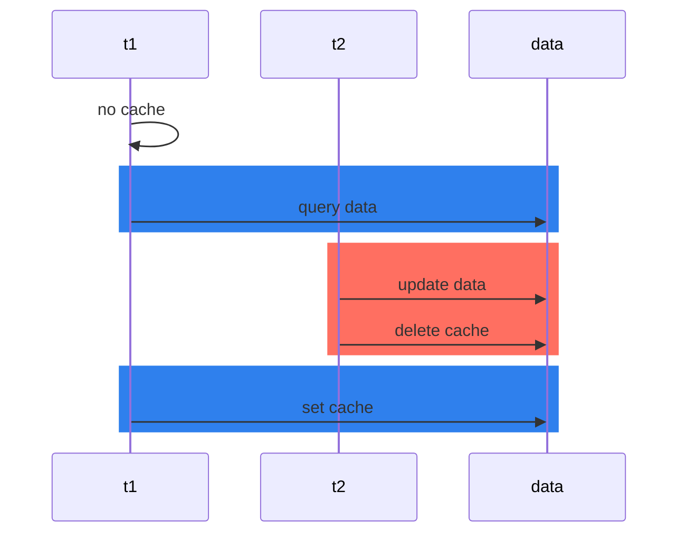

## 单线程/多线程

redis单线程？

- 3.x版本，redis是单线程的
- 4.x版本，除了 delete 和 dump数据文件 是多线程的，其他的都是单线程
- 6.0.x后，除了核心的数据读写，其他的都是多线程

为什么redis单线程还这么快

-  数据在内存中，纳秒级别，速度快 
-  数据结构简单：大部分操作都是O（1）的时间复杂度 
-  io多路复用：使用io多路复用功能来监听多个socket连接客户端，这样就能一个线程来处理多个请求，减少线程切换的开销，同时也避免了io阻塞 
-  工作线程使用单线程，避免锁的开销和线程上下文切换 

为什么之前单线程这么快，还要用多线程

-  redis的单线程是指网络io和键值对的读写是由一个线程执行的，redis在处理客户端请求时包括获取（socket读）、解析、执行、内容返回（socket写）等都是由一个顺序串行的主线程处理。其他功能是额外线程进行的，比如持久化、异步删除、集群数据同步等等 
- 由于是单线程，所有的操作都是排队的，当删除大key时，需要消耗的时间长，此时线程阻塞，后续的请求一直等待，直到超时。可以使用unlink key、flushdb async或者flushall async进行异步删除（redis4.x新增） 
-  redis的工作线程是单线程的，但是整个redis来说，是多线程的 

由于redis数据结构简单，所以redis的瓶颈不是cpu，就剩内存和网络了，内存可以加钱购买，所以就是网络io了

> I/O 多路复用，简单来说就是通过监测文件的读写事件再通知线程执行相关操作，保证 Redis 的非阻塞 I/O 能够顺利执行完成的机制。
多路指的是多个socket连接，
复用指的是复用一个线程。多路复用主要有三种技术：select，poll，epoll。
>  
> epoll是最新的也是目前最好的多路复用技术。采用多路 I/O 复用技术可以让单个线程高效的处理多个连接请求（尽量减少网络IO的时间消耗），且Redis在内存中操作数据的速度非常快（内存内的操作不会成为这里的性能瓶颈），主要以上两点造就了Redis具有很高的吞吐量。


-  I/O 的读和写本身是堵塞的，比如当 socket 中有数据时，Redis 会通过调用先将数据从内核态空间拷贝到用户态空间，再交给 Redis 调用，而这个拷贝的过程就是阻塞的，当数据量越大时拷贝所需要的时间就越多，而这些操作都是基于单线程完成的。
 
-  在 Redis 6.0 中新增了多线程的功能来提高 I/O 的读写性能，他的主要实现思路是将主线程的 IO 读写任务拆分给一组独立的线程去执行，这样就可以使多个 socket 的读写可以并行化了，采用多路 I/O 复用技术可以让单个线程高效的处理多个连接请求（尽量减少网络IO的时间消耗），将最耗时的Socket的读取、请求解析、写入单独外包出去，剩下的命令执行仍然由主线程串行执行并和内存的数据交互。
 
-  结合上图可知，网络IO操作就变成多线程化了，其他核心部分仍然是线程安全的，是个不错的折中办法。 

在redis6.0中，多线程默认是关闭的，可以通过修改配置文件开启多线程

- `io-thread-do-reads yes` 开启多线程，默认为no
- `io-threads 4`设置线程数，如果机器cpu核数为4，官方建议设置为2/3，如果为8核设置为6，线程数一定要小于核数，线程数并不是越多越好

## springboot简单整合redis

```java
@Service
public class UserServiceImpl extends ServiceImpl<UserMapper, User>
    implements UserService{

    private static final String CACHE_KEY_USER = "USER::";

    @Autowired
    private RedisTemplate redisTemplate;

    @Override
    public void addUser(User user) {
        // 将数据添加到mysql
        boolean flag = this.save(user);
        if (flag) {
            // 防止网络抖动等其他意外因素，再次查询，确保mysql插入成功
            User result = this.getById(user.getId());
            String key = CACHE_KEY_USER + user.getId();
            redisTemplate.opsForValue().set(key,result);

        }
    }

    @Override
    public void deleteUser(Integer id) {
        int i = baseMapper.deleteById(id);
        if (i > 0 ){
            redisTemplate.delete(CACHE_KEY_USER + id);
        }
    }

    @Override
    public void updateUser(User user) {
        int i = baseMapper.updateById(user);
        if (i > 0 ){
            User result = this.getById(user.getId());
            redisTemplate.opsForValue().set(CACHE_KEY_USER+user.getId(),result);
        }
    }

    @Override
    public User getUserById(Integer id) {
        User user = null;
        // redis中没有数据
        user = (User) redisTemplate.opsForValue().get(CACHE_KEY_USER + id);
        if (user == null) {
            // 加锁防止缓存击穿
            synchronized (UserServiceImpl.class) {
                // 双端检索，防止漏网之鱼已经从mysql中查出数据并且缓存好了
                user = (User) redisTemplate.opsForValue().get(CACHE_KEY_USER + id);
                if (user == null) {
                    user = baseMapper.selectById(id);
                    if (user == null) {
                        return null;
                    } else {
                        redisTemplate.opsForValue().set(CACHE_KEY_USER+id,user,10, TimeUnit.MINUTES);
                    }
                }
            }
        }

        return user;
    }

}
```

## 五大常用基本数据类型

### **String**

-  设置，获取 
   - set key value
   - get key
-  设置/获取多个key 
   - mset key value [key value ...]
   - mget key [key ...]
-  数值递增/递减 
   - 递增数字 incr key
   - 增加指定的数值 incrby key increment
   - 递减数字 decr key
   - 递减指定的数值 decrby key decrement
-  获取字符串长度 
   - strlen key
-  分布式锁 
   - setnx key value
   - set key value [ex seconds] [px milliseconds] [nx|xx] 
      - `EX` _seconds_ – 设置键key的过期时间，单位时秒
      - `PX` _milliseconds_ – 设置键key的过期时间，单位时毫秒
      - `NX` – 只有键key不存在的时候才会设置key的值
      - `XX` – 只有键key存在的时候才会设置key的值

#### 应用场景

点赞，阅读量

### **hash**

-  设置一个字段的值 
   - hset key field value
-  获取一个字段的值 
   - hget key field
-  设置多个字段的值 
   - hmset key field value [field value ...]
-  获取多个字段的值 
   - hmget key field [field ...]
-  获取所有字段值 
   - hgetall key
-  获取key字段的全部数量 
   - hlen key
-  删除key的字段 
   - hdel key field [field...]

#### 应用场景

jd早期购物车，key为用户id，field为商品id，value为商品数量

### **list**

双端链表，左右都可以添加元素，一般用在栈、队列、消息队列等等

-  列表左边添加元素 
   - lpush key value [value ...]
-  列表右边添加元素 
   - rpush key value [value ...]
-  查看列表元素 
   - lrange key start stop
-  获取列表元素个数 
   - llen key

#### 应用场景

公众号订阅，文章推送lpush，查看订阅的公众号lrange；商品评论，key为商品id，value为json格式评论数据{id,name,date,content}，lpush存入，lrange取出

### **set**

无重复的元素集合

-  添加元素 
   - sadd key member  [member ...]
-  删除元素 
   - srem key member [member ...]
-  遍历集合中所有的元素 
   - smembers key
-  判断元素是否在集合中 
   - sismember key member
-  获取集合中的元素总数 
   - scard key
-  从集合中随机弹出一个元素，不删除元素 
   - srandmember key [数字]
-  从集合中随机弹出一个元素，并删除 
   - spop key [数字]
-  集合运算 
   - 差集运算，a中有b中没有的元素 
      - sdiff a b
   - 交集运算，a b中都有的元素 
      - sinter a b
   - 并集运算，a b合并后的元素 
      - sunion a b

#### 应用场景

微信小程序抽奖：key为奖品id，member为用户id，sadd添加用户，scard统计人数，spop取出中将用户；

微信朋友圈点赞：key为用户id，member为其他用户id，sadd添加点赞用户，srem取消点赞，scard统计点赞人数（红点气泡），smember点赞列表展示，sismember判断用户是否点赞

微博好友社交关系：共同关注的人sinter

qq可能人数的人：sdiff

### zset

无重复，带分数的元素集合

-  添加元素 
   - zadd key score member [score member ...]
-  按照元素分数从小到大返回指定范围的元素 
   - zrange key start stop [withscores]
-  获取元素的分数 
   - zscore key member
-  删除元素 
   - zrem key member [mebmer ...]
-  获取指定分数范围内的元素 
   - zrangebyscore key min max [withscores] [limit offset count]
-  增加元素分数 
   - zincrby key increment member
-  获取集合元素数量 
   - zcard key
-  获得指定分数范围内的元素个数 
   - zcount key min max
-  按照排名范围删除元素 
   - zremrangebyrank key start stop
-  获取元素排名 
   - 从小到大：zrank key member
   - 从大到小：zrevrank key member

#### 应用场景

商品销售榜：key为商品分类，score为销售量，member为商品id，每次售出zincrby，获取销售量zscore，销售排行zrevrange

微博热搜：key为日期，score为点击量，member为标题

## 文章阅读量点赞量案例

```java
private static final Long MAX_VIEWS = 10_0000L;
private static final String CACHE_KEY_ARTICLE = "article";

    /**
     * 先获取点赞量，如果点赞量超过10W就不做操作（高并发，大热key，降温 不做处理），如果未达到阈值就进行incr
     * @param id 
     */
Long articleViewIncr(Integer id) {
    Long views = (Long) redisTemplate.opsForValue().get(id);
    if (views > MAX_VIEWS) {
        return views;
    } else {
        return redisTemplate.opsForValue().increment(CACHE_KEY_ARTICLE+id);
    }
}
```

## 抖音评论最新评论分页显示

需要排序+分页，可以使用list和zset

list按时间顺序存入数据，key为视频id，value为json评论数据

```shell
# 有6条数据，f为最新数据
> lpush k1 a b c d e f
6
# 取最新3条数据
> lrange k1 0 2
f
e
d
# 取下一页的3条数据
> lrange k1 3 5
c
b
a
# 看样子可以完成需求，但是这是在数据没有变化的情况下
> lrange k1 0 2
f
e
d
# 第一页数据正常取出，此时又有新评论需要添加进列表
> lpush k1 g
7
# 取第二页数据，此时又取到了d这个数据，因为第二次分页是固定的，但是列表添加了元素，此时后面的元素就会后移一位，取到的就有重复数据。
> lrange k1 3 5
d
c
b
```

使用zset，key为视频id，score为时间戳，value为json数据

```shell
> zadd k1 1637417272939 v1 1637417292937 v2 1637417292937 v3 1637417310937 v4 1637417315937 v5 1637417324937 v6
6
# 存入的时间戳，数值越大，评论越新，rev反转排序，取出最大的3条记录，就算是新插入分页也不会出现重复数据
> zrevrange k1 0 2
v6
v5
v4
> zrevrange k1 3 5
v3
v2
v1
#通过时间区间取出数据
> zrevrangebyscore k1 1637417324937 1637417292937
v6
v5
v4
v3
v2
#通过时间区间分页取出数据
> zrevrangebyscore k1 1637417324937 1637417292937 limit 0 3
v6
v5
v4
```

## bitmap/hyperloglog/geo

### bitmap

> 位图不是实际的数据类型，而是在 String 类型上定义的一组面向位的操作。由于字符串是二进制安全的 blob，并且它们的最大长度为 512 MB，因此它们适合设置多达 2^32 个不同的位。
>  
> 位操作分为两组：恒定时间的单个位操作，例如将位设置为 1 或 0，或获取其值，以及对位组的操作，例如计算给定位范围内设置位的数量（例如，人口计数）。
>  
> 位图的最大优点之一是它们在存储信息时通常可以极大地节省空间。例如，在不同用户由增量用户 ID 表示的系统中，仅使用 512 MB 的内存就可以记住 40 亿用户的单个位信息（例如，知道用户是否想要接收时事通讯）
>  
> 每次扩容为8bit=1byte


- `SETBIT key offset value`设置偏移量上的值
- `GETBIT key offset`获取偏移量上的值
- `BITCOUNT key [start] [end]`总计出现1的次数

- `BITPOS key bit [start] [end]`0或1最先出现的位置
- `BITOP AND destkey srckey1 srckey2 srckey3 ... srckeyN`逻辑与
- `BITOP OR destkey srckey1 srckey2 srckey3 ... srckeyN`逻辑或
- `BITOP XOR destkey srckey1 srckey2 srckey3 ... srckeyN`逻辑异或
- `BITOP NOT destkey srckey`逻辑非

```shell
> setbit k1 1 1
0
> setbit k1 7 1
0
# 0100 0001 第二个位置为1，第八个位置为1，其他位置为0

> getbit k1 0
0
> getbit k1 1
1
# 获取值为1的总数
> bitcount k1
2
# 由于本质是string类型，所有可以使用strlen，但是长度是byte为单位，所以就是1
> strlen k1
1
# 由于本质是string类型，可以使用get，返回后的为对应的ascii值，此时是0100 0001就是A
> get k1
A
# 统计0最先出现的位置
> bitpos k1 0
0
# 统计1最先出现的位置
> bitpos k1 1
1
```

### 统计名词

**UV**：Unique Visitor，独立访客，一般理解为客户端ip，需考虑去重

**PV**：Page View，页面浏览量，不用去重

**DAU**：Daily Active User，日常活跃用户，登录或使用了某个产品的用户数（去重复登录的用户）。常用于反映网站、互联网应用或者网络游戏的运营情况

**MAU**：Monthly Active User，月活跃用户量

### 基数统计（bimap）

网站UV统计

使用bitmap可以进行统计，建立ip和id的映射，bitmap的偏移量就是id。

假设一个小时有一亿个ip，一亿个基数数据，一个样本就是一亿。

如果要统计一亿个基数位，大约需要内存100000000/8/1024/1024约等于12M，看样子还可以。

但是这个只是一个小时的数据，如果是一天呢，一个月呢。

如果需要统计的样本有10000个（1万个一亿），大于需要120G，所以bitmap不适应用大数据量（亿级）的基数统计场景

但是统计的数据是准确的

### hyperloglog

HyperLogLog 是一种用于**计算唯一事物**的概率数据结构（从技术上讲，这称为估计集合的基数）。通常计算唯一项目需要使用与您要计算的项目数量成正比的内存量，因为您需要记住过去已经看过的元素，以避免对它们进行多次计数。但是，有一组算法可以用**内存换取精度**：您以带有标准误差的估计度量结束，在 Redis 实现的情况下，该标准误差小于 1%。该算法的神奇之处在于，您不再需要使用与计数的项目数成正比的内存量，而是可以使用恒定数量的内存！**在最坏的情况下为 12k 字节**，如果您的 HyperLogLog（从现在起我们将它们称为 HLL）看到的元素很少，则更少。

-  去重复 
-  牺牲准确率换内存 
-  不存储元素本身 

> [http://antirez.com/news/75](http://antirez.com/news/75)
>  
> HyperLogLog 非常出色，因为即使使用很少的内存，它也提供了一个非常好的集合基数近似值。在 Redis 实现中，每个键仅使用 12kbytes 进行计数，标准误差为 0.81%，并且可以计数的项目数量没有限制，除非您接近 2^64 个项目（这似乎不太可能）。
>  
> Redis 的实现
>  
> HyperLogLog 的标准误差是 1.04/sqrt(m)，其中“m”是使用的寄存器数量。
Redis 使用了 16384 个寄存器，因此标准误差为 0.81%。


**为什么 redis-cluster 使用 16384 个插槽？**

redis没有使用一致性hash，而是引入了哈希槽的概念。redis集群有16384个哈希槽，每个key通过crc16校验后对16384取模来决定放在哪个槽，集群的每个节点负责一部分hash槽。

> crc16算法产生的hash值有16bit，该算法可以产生2^16=65536个值
>  
> 就是说值是分布在0~65535之间。那在做取模运算时，为什么不mod65535，而是16384


[https://github.com/redis/redis/issues/2576](https://github.com/redis/redis/issues/2576)

原因是：

1. 正常的心跳数据包携带节点的完整配置，可以以幂等方式替换旧配置以更新旧配置。这意味着它们包含原始形式的节点的插槽配置，该节点使用 2k 空间和 16k 插槽，但使用 65k 插槽会使用令人望而却步的 8k 空间。
2. 同时，由于其他设计权衡，Redis Cluster 不太可能扩展到超过 1000 个主节点。

所以 16k 是在正确的范围内，以确保每个 master 有足够的插槽，最多 1000 个 maters，但这个数量足够小，可以轻松地将插槽配置作为原始位图传播。请注意，在小集群中，位图将难以压缩，因为当 N 小时，位图将设置的槽位/N 位占很大比例的位。

简单来说：

-  集群间需要发送心跳包，携带集群插槽配置信息，如果使用65536个槽的话就需要传输85536/8/1024=8k的数据；但是如果使用16384个槽的话就只需要传输16384/8/1024=2k的数据。 
-  只要集群节点不超过1000个使用16384就没问题。 
-  redis主节点的哈希槽配置是通过bitmap保存的，传输过程中会对bitmap进行压缩，插槽填充率越低，压缩率越高，所以插槽数量小，压缩率高  
> bitmap填充率 = slots(插槽数)/N(节点数)


### 基数统计（hyperloglog）

统计淘宝uv，使用hyperloglog，key为日期，value为ip

```shell
# 添加数据
> pfadd tb:1 10.123.67.3 10.123.67.4 10.123.67.5
1
# 统计uv
> pfcount tb:1
3
> pfadd tb:2 10.123.67.3 10.123.67.4 10.123.67.5 10.123.67.6 10.123.67.7 10.123.67.8
1
> pfcount tb:2
6
# 合并2天的数据
> pfmerge result tb:1 tb:2
OK
# 2t
> pfcount result
6
```

### geo

geo本质上是zset，经纬度相当于分数

-  geoadd：添加地理位置的坐标。  
```shell
geoadd key longitude latitude member [longitude latitude member ...]
```

-  geopos：获取地理位置的坐标。  
```shell
geopos key member [member ...]
```

-  geodist：计算两个位置之间的距离。  
```shell
geodist key member1 member2 [m|km|ft|mi]
```

-  georadius：根据用户给定的经纬度坐标来获取指定范围内的地理位置集合。  
```shell
georadius key longitude latitude radius m|km|ft|mi [WITHCOORD] [WITHDIST] [WITHHASH] [COUNT count] [ASC|DESC] [STORE key] [STOREDIST key]

127.0.0.1:6379>  georadius city 117 40 100 km withdist
1) 1) "tiananmen"
   2) "52.4797"
2) 1) "beijing"
   2) "52.2303"
```

-  georadiusbymember：根据储存在位置集合里面的某个地点获取指定范围内的地理位置集合。  
```shell
georadiusbymember key member radius m|km|ft|mi [WITHCOORD] [WITHDIST] [WITHHASH] [COUNT count] [ASC|DESC] [STORE key] [STOREDIST key]

127.0.0.1:6379> georadiusbymember city beijing 200 km withdist withcoord count 10
1) 1) "tiananmen"
   2) "1.4099"
   3) 1) "116.39741867780685"
      2) "39.903852867833116"
2) 1) "beijing"
   2) "0.0000"
   3) 1) "116.39712899923325"
      2) "39.916526473629808"
127.0.0.1:6379>
```

   - m ：米，默认单位。
   - km ：千米。
   - mi ：英里。
   - ft ：英尺。
   - WITHDIST: 在返回位置元素的同时， 将位置元素与中心之间的距离也一并返回。
   - WITHCOORD: 将位置元素的经度和维度也一并返回。
   - WITHHASH: 以 52 位有符号整数的形式， 返回位置元素经过原始 geohash 编码的有序集合分值。 这个选项主要用于底层应用或者调试， 实际中的作用并不大。
   - COUNT 限定返回的记录数。
   - ASC: 查找结果根据距离从近到远排序。
   - DESC: 查找结果根据从远到近排序。
-  geohash：返回一个或多个位置对象的 geohash 值。  
```shell
geohash key member [member ...]
127.0.0.1:6379> geohash city beijing
1) "wx4g0dtf9e0"
127.0.0.1:6379> geohash city shanghai
1) "wtw6st1uuq0"
127.0.0.1:6379>
```

## 布隆过滤器【缓存穿透】

布隆过滤器（Bloom Filter）是1970年由布隆提出的。它实际上是一个很长的**二进制向量**和**一系列随机映射函数**。布隆过滤器可以用于检索一个元素是否在一个集合中。它的优点是**空间效率和查询时间都远远超过一般的算法**，**缺点是有一定的误识别率和删除困难**。

布隆过滤器的原理是，当一个元素被加入集合时，通过K个散列函数将这个元素映射成一个位数组中的K个点，把它们置为1。检索时，我们只要看看这些点是不是都是1就（大约）知道集合中有没有它了：如果这些点有任何一个0，则被检元素一定不在；如果都是1，则被检元素很可能在。这就是布隆过滤器的基本思想。

简单来说就是由一个二进制数组（bit数组）和一堆hash算法组成。

布隆过滤器本身是不存储数据的，只是在数据进过运算后在对应的位置打上标记。

优点：

- 占用空间小
- 插入/查询时间都是常数（O(n)）

缺点：

- 有一定的误判率；误判只会发生在没有添加过的数据，添加过的数据不会发生误判
- 删除困难（基本不能删除）

**初始化**

初始化为m个二进制的数组(全部都为0)，和bitmap类似；还有k个hash函数


**添加数据**

将要添加的数据分别对k个hash函数进行运算，得到值对m数组长度进行取模得到对应的n，将每个n的位置上的值置为1

假设：

1. YXEBJGR --> fun1() = 1
2. YXEBJGR --> fun1() = 3
3. YXEBJGR --> fun1() = 5

YXEBJGR进过hash函数的得到值为1，3，5

再进行取模

1. 1 % 10 = 1
2. 3 % 10 = 3
3. 5 % 10 = 5

最后在1，3，5的位置上置为1


**取数据**

取数据时，也会把数据经过hash运算然后取模得到n

- 如果n上对应的值全部都是0就说明这个数据不存在
- 如有是1说明这个数据极大的可能存在，为什么不是一定存在呢。因为可能存在hash冲突，共用一个索引值。

**再次添加数据**

假设：

原来1、3、5位置上是1，现在添加HUBVCYS后，0、4位置也是1（1位置发生hash冲突，2个数据共用这个位置），最后就是0、1、3、4、5位置是1
再添加XUGJWB，通过计算后得到位置1、3、4，发现都是1，1就是有这个数据，就去redis中查询，但是实际上没有这个值（由于hash冲突）


**为什么不能删除数据**

因为会存在hash冲突，多个key公用一个位置，当删除一个key时，就删除对应位置上的标记（就是1），但是其他的key也使用了这个位置。

**安装RedisBloom**

**直接编译进行安装**

```bash
git clone https://github.com/RedisBloom/RedisBloom.git
cd RedisBloom
make     #编译 会生成一个rebloom.so文件
redis-server --loadmodule /path/to/rebloom.so   #运行redis时加载布隆过滤器模块
redis-cli    # 启动连接容器中的 redis 客户端验证
```

**使用Docker进行安装**

```bash
docker pull redislabs/rebloom:latest # 拉取镜像
docker run -p 6379:6379 --name redis-redisbloom redislabs/rebloom:latest #运行容器
docker exec -it redis-redisbloom bash
redis-cli
```

[https://oss.redis.com/redisbloom/Bloom_Commands/](https://oss.redis.com/redisbloom/Bloom_Commands/)

使用：

-  bf.reserve key error_rate initial_size
指定key的存储个数和错误率 

- bf.add 添加元素到布隆过滤器
- bf.exists 判断元素是否在布隆过滤器
- bf.madd 添加多个元素到布隆过滤器，bf.add 只能添加一个
- bf.mexists 判断多个元素是否在布隆过滤器

**Redisson中带有布隆过滤器**

```java
public static void main(String[] args) {
    Config config = new Config();
    config.useSingleServer().setAddress("redis://192.168.83.128:6379");
    RedissonClient redisson = Redisson.create(config);

    RBloomFilter<String> bloomFilter = redisson.getBloomFilter("user");
    // 初始化布隆过滤器，预计统计元素数量为55000000，期望误差率为0.03
    bloomFilter.tryInit(55000000L, 0.03);
    bloomFilter.add("Tom");
    bloomFilter.add("Jack");
    System.out.println(bloomFilter.count());   //2
    System.out.println(bloomFilter.contains("Tom"));  //true
    System.out.println(bloomFilter.contains("Linda"));  //false
}
```

查看redis

```shell
127.0.0.1:6379> keys *
1) "user"
2) "{user}:config"
127.0.0.1:6379> type user
string
127.0.0.1:6379> type {user}:config
hash
127.0.0.1:6379> hgetall {user}:config
1) "size"
2) "401414246"
3) "hashIterations"
4) "5"
5) "expectedInsertions"
6) "55000000"
7) "falseProbability"
8) "0.03"
```

-  添加的user为string类型对应55000000比特数组转义后的很长一串的_x00\x00\x00\x00_十六进制字符 
-  {user}:config为bloom的配置 
   - size：初始化一个大小为401414246比特的数组
   - hashIterations：使用的哈希函数为5个
   - expectedInsertions：预期插入55000000个数据
   - falseProbability：误差率为0.03%

## 模拟聚划算商品定时上架【缓存击穿】

聚划算每个商品分类显示20条数据，由于访问人数过多，所以不能直接访问mysql

数据存在mysql中，并在redis中缓存一份，每当

```java
private static final String CACHE_JHS_KEY_A = "jhs:a";
private static final String CACHE_JHS_KEY_B = "jhs:b";

/**
 * 前端接口
 * @param page 
 * @param size
 * @return
 */
public List<Product> getProductList(Integer page,Integer size) {
    List<Product> list = null;
    Integer start = (page - 1) * size;
    Integer end = start + size - 1;
    try {
        list = redisTemplate.opsForList().range(CACHE_JHS_KEY_A, start, end);
        if (CollectionUtil.isEmpty(list)) {
            list = redisTemplate.opsForList().range(CACHE_JHS_KEY_B, start, end);
        }
    } catch (Exception e) {
        log.error(e.getMessage());
        // TODO  加锁查询mysql
    }
    return list;
}

/**
 * 模拟定时任务，每天执行一次
 * 把mysql中的数据缓存到redis
 */
@Scheduled(cron = "0 0 0 * * ? ")
private void task() {
    List<Product> productFromMysql = this.getProductFromMysql();
    /*
    * 先删再加
    * 使用ab缓存，防止删除时，再添加前，有大量请求访问mysql（缓存击穿）
    * 设置不同的过期时间，防止同时过期，导致大量请求打到mysql
    * 更新时先更新b，查询时先查询a
    * */
    redisTemplate.unlink(CACHE_JHS_KEY_B);
    redisTemplate.opsForList().leftPushAll(CACHE_JHS_KEY_B, productFromMysql);
    redisTemplate.expire(CACHE_JHS_KEY_B, 26L, TimeUnit.HOURS);

    redisTemplate.unlink(CACHE_JHS_KEY_A);
    redisTemplate.opsForList().leftPushAll(CACHE_JHS_KEY_A, productFromMysql);
    redisTemplate.expire(CACHE_JHS_KEY_A, 25L, TimeUnit.HOURS);

}

/**
 * 模拟数据库中查询记录
 * @return
 */
private List<Product> getProductFromMysql() {
    List<Product> list = new ArrayList<>();
    for (int i = 0; i < 100; i++) {
        list.add(new Product(i, RandomUtil.randomString(3),RandomUtil.randomString(10), (int) RandomUtil.randomNumber()));
    }
    return list;
}
```

## 分布式锁

### 概述

加锁：

- 加锁解锁使用相同的key，value为随机的。
- 加锁时设置过期时间，操作为原子性。

解锁：

-  解锁时需判断锁的value是不是当前线程设置的value，避免解锁其他线程的锁。 
-  如果当前线程的value对应就删除锁，判断是否同一个value和释放锁需原子性。  
```java
RLock lock = redisson.getLock("myLock");

// traditional lock method
lock.lock();

// or acquire lock and automatically unlock it after 10 seconds
lock.lock(10, TimeUnit.SECONDS);

// or wait for lock aquisition up to 100 seconds 
// and automatically unlock it after 10 seconds
boolean res = lock.tryLock(100, 10, TimeUnit.SECONDS);
if (res) {
   try {
     ...
   } finally {
       if (redissonLock.isLocked() && redissonLock.isHeldByCurrentThread()) {
            redissonLock.unlock();
        }
   }
}
```

基于Redis的Java分布式可重入[Lock](https://static.javadoc.io/org.redisson/redisson/latest/org/redisson/api/RLock.html)对象并实现[Lock](https://docs.oracle.com/javase/8/docs/api/java/util/concurrent/locks/Lock.html)接口。

如果获取锁的 Redisson 实例崩溃，那么这种锁可能会永远挂在已获取状态。为避免此 Redisson 维护锁看门狗，它会在锁持有者 Redisson 实例活着时延长锁到期时间。默认锁定看门狗超时为 30 秒，可以通过[Config.lockWatchdogTimeout](https://github.com/redisson/redisson/wiki/2.-Configuration#lockwatchdogtimeout)设置更改。

Redisson 还允许`leaseTime`在获取锁期间指定参数。在指定的时间间隔后，锁定的锁将自动释放。

`RLock`对象的行为符合 Java Lock 规范。这意味着只有锁所有者线程可以解锁它，否则`IllegalMonitorStateException`会被抛出。否则考虑使用[RSemaphore](https://github.com/mrniko/redisson/wiki/8.-distributed-locks-and-synchronizers/#86-semaphore)对象。

```java

Config config = new Config();
config.useSingleServer().setAddress("redis://192.168.83.128:6379").setDatabase(0);
RedissonClient redissonClient = Redisson.create(config);
RLock lock = redissonClient.getLock(LOCK_KEY);
// 如果锁被其他线程持有，等待100秒，预计业务执行10秒，自动续期
boolean flag = lock.tryLock(100, 10, TimeUnit.SECONDS);
if (flag) {
    try {
        // do something
    } finally {
        lock.unlock();
    }
}
```

### RedLock

并发量不大的情况下直接单个redis可以，但是如果高并发，一个redis顶不住，宕机了，锁不住了怎么办呢。

那就用多个redis，是主从、哨兵、还是集群呢，都不行。

因为单个redis是cp，集群就是ap

1.  主节点收到set命令，操作完成后，返回执行成功结果，并把数据同步到从节点 
2.  但是如果主节点操作完成了，给客户端返回成功结果了，还没来得及给从节点同步数据，这时主节点挂了。 
3.  从节点晋升为主节点。 
4.  此时数据就不一致了，可能多个线程共同持有一把锁，那就和没加锁一样。 

解决：

1. 它以毫秒为单位获取当前时间。
2. 它尝试顺序获取所有 N 个实例中的锁，在所有实例中使用相同的键名和随机值。在第 2 步中，当在每个实例中设置锁时，客户端使用一个比总锁自动释放时间更小的超时来获取它。例如，如果自动释放时间为 10 秒，则超时可能在 ~ 5-50 毫秒范围内。这可以防止客户端长时间保持阻塞状态，试图与已关闭的 Redis 节点通信：如果实例不可用，我们应该尽快尝试与下一个实例通信。
3. 客户端通过从当前时间中减去步骤 1 中获得的时间戳来计算获取锁所用的时间。当且仅当客户端能够在大多数实例（至少 3 个）中获取锁，并且获取锁所用的总时间小于锁有效时间，则认为该锁被获取。
4. 如果获得了锁，则其有效时间被认为是初始有效时间减去经过的时间，如步骤 3 中计算的那样。
5. 如果客户端由于某种原因获取锁失败（或者它无法锁定 N/2+1 个实例或有效时间为负），它将尝试解锁所有实例（即使是它认为不是的实例）能够锁定）。

简单来说：使用多个主节点。加锁时，向多个主节点set，如果至少有 **N/2+1** 数量的节点操作成功，且获取锁未超时，就加锁成功。否则就加锁失败。

节点数量：N = 2X + 1 ：

- N为节点总数
- X为可以允许坏掉（宕机）的节点数量

假设可以允许一个节点坏掉 2*1+1 = 3，最少需要3个redis

假设可以允许二个节点坏掉 2*2+1 = 5，最少需要5个redis

```java
@SneakyThrows
public void testRedissonLock() {
    // 配置1
    Config config1 = new Config();
    config1.useSingleServer().setAddress("redis://192.168.83.127:6379").setDatabase(0);
    RedissonClient redissonClient1 = Redisson.create(config1);
    RLock lock1 = redissonClient1.getLock(LOCK_KEY);

    // 配置2
    Config config2 = new Config();
    config2.useSingleServer().setAddress("redis://192.168.83.128:6379").setDatabase(0);
    RedissonClient redissonClient2 = Redisson.create(config2);
    RLock lock2 = redissonClient2.getLock(LOCK_KEY);

    // 配置3
    Config config3 = new Config();
    config3.useSingleServer().setAddress("redis://192.168.83.129:6379").setDatabase(0);
    RedissonClient redissonClient3 = Redisson.create(config3);
    RLock lock3 = redissonClient3.getLock(LOCK_KEY);


    RedissonRedLock redLock = new RedissonRedLock(lock1,lock2,lock3);
    // 等待100秒，预计业务执行需要10秒
    boolean flag = redLock.tryLock(100, 10, TimeUnit.SECONDS);
    if (flag) {
        try {
            // do something
        } finally {
            redLock.unlock();
        }
    }

}
```

### 底层实现

底层分析

默认过期时间30秒 `Config.java`

```java
private long lockWatchdogTimeout = 30 * 1000;
```

**加锁lua脚本**

```java
"if (redis.call('exists', KEYS[1]) == 0) then " +
    "redis.call('hset', KEYS[1], ARGV[2], 1); " +
    "redis.call('pexpire', KEYS[1], ARGV[1]); " +
    "return nil; " +
"end; " +
"if (redis.call('hexists', KEYS[1], ARGV[2]) == 1) then " +
    "redis.call('hincrby', KEYS[1], ARGV[2], 1); " +
    "redis.call('pexpire', KEYS[1], ARGV[1]); " +
    "return nil; " +
"end; " +
"return redis.call('pttl', KEYS[1]);"
```

一共3个判断

-  如果key不存在，就加锁
使用hset，key为传入的key，field为uuid+":"+threadId，value为1 
并设置过期时间，默认30秒
最后返回null  
```java
// 对应field
protected String getLockName(long threadId) {
    return id + ":" + threadId;
}
```
```lua
if (redis.call('exists', KEYS[1]) == 0) then 
    redis.call('hset', KEYS[1], ARGV[2], 1); 
    redis.call('pexpire', KEYS[1], ARGV[1]); 
    return nil; 
end;
```

-  如果不存在就走上面的流程，存在就判断是不是当前线程加锁的
即key要对应，field也要对应即uuid+“:”+threadId
如果对应上了就将value+1，可重入锁
重新设置过期时间  
```lua
if (redis.call('hexists', KEYS[1], ARGV[2]) == 1) then
    redis.call('hincrby', KEYS[1], ARGV[2], 1); 
    redis.call('pexpire', KEYS[1], ARGV[1]); 
    return nil; 
end;
```

-  如果key存在，且不是当前线程加锁的，就说明是其他线程加锁的，返回锁的剩余时间pttl  
```lua
return redis.call('pttl', KEYS[1]);
```

加锁成功后会新建一个看门狗线程，定期续时

还剩三分之一时间时，就重新设置锁的过期时间

`RedissonLock.java` 296行

```java
internalLockLeaseTime / 3
```

**解锁lua脚本**

```java
"if (redis.call('hexists', KEYS[1], ARGV[3]) == 0) then " +
    "return nil;" +
 "end; " +
"local counter = redis.call('hincrby', KEYS[1], ARGV[3], -1); " +
"if (counter > 0) then " +
    "redis.call('pexpire', KEYS[1], ARGV[2]); " +
    "return 0; " +
"else " +
    "redis.call('del', KEYS[1]); " +
    "redis.call('publish', KEYS[2], ARGV[1]); " +
    "return 1; "+
"end; " +
"return nil;"
```

也是3个判断

-  如果key和当前线程的field对应不上，说明不是这个线程的锁或者锁已经被释放了，返回null  
```lua
if (redis.call('hexists', KEYS[1], ARGV[3]) == 0) then
    return nil;
 end;
```

-  如果对应上了，将对应的value-1得到counter 
   - 如果counter > 0，说明锁重入了，需要加几次锁就要解锁几次，此时重新设置锁的过期时间，并发回0，即false
   - 否则就说明只加锁了一次，直接del对应的key，并发布消息到订阅，并返回1，即true
```lua
local counter = redis.call('hincrby', KEYS[1], ARGV[3], -1); 
    if (counter > 0) then 
    redis.call('pexpire', KEYS[1], ARGV[2]); 
    return 0; 
    else 
    redis.call('del', KEYS[1]);
    redis.call('publish', KEYS[2], ARGV[1]); 
    return 1;
end;
```

-  如果前面的都对应不上，直接返回null  
```lua
return nil;
```

如果解锁成功就结束看门狗线程

```java
if (e != null) {
    cancelExpirationRenewal(threadId);
    result.tryFailure(e);
    return;
}
```

### 脚本的原子性

Redis 使用相同的 Lua 解释器来运行所有命令。Redis 还保证以原子方式执行脚本：在执行脚本时不会执行其他脚本或 Redis 命令。这种语义类似于[MULTI](https://redis.io/commands/multi) / [EXEC 之一](https://redis.io/commands/exec)。从所有其他客户端的角度来看，脚本的效果要么仍然不可见，要么已经完成。

然而，这也意味着执行慢速脚本不是一个好主意。创建快速脚本并不难，因为脚本开销非常低，但是如果您打算使用慢速脚本，您应该意识到在脚本运行时没有其他客户端可以执行命令。

[https://redis.io/commands/eval#sandbox-and-maximum-execution-time](https://redis.io/commands/eval#sandbox-and-maximum-execution-time)

### 沙盒和最长执行时间

脚本永远不应该尝试访问外部系统，如文件系统或任何其他系统调用。脚本应该只对 Redis 数据和传递的参数进行操作。

脚本也受最大执行时间限制（默认为 5 秒）。这个默认超时时间很大，因为脚本通常应该在一毫秒内运行。限制主要是为了处理开发过程中创建的意外无限循环。

可以通过`redis.conf`或使用 CONFIG GET / CONFIG SET 命令以毫秒精度修改脚本的最大执行时间。影响最大执行时间的配置参数称为 `lua-time-limit`。

当脚本达到超时时，它不会被 Redis 自动终止，因为这违反了 Redis 与脚本引擎的约定，以确保脚本是原子的。中断脚本意味着可能会将数据集保留为写入一半的数据。出于这个原因，当脚本执行时间超过指定时间时，会发生以下情况：

- Redis 记录脚本运行时间过长。
- 它再次开始接受来自其他客户端的命令，但会以 BUSY 错误回复所有发送正常命令的客户端。此状态下唯一允许的命令是[SCRIPT KILL](https://redis.io/commands/script-kill)和`SHUTDOWN NOSAVE`.
- 可以使用[SCRIPT KILL](https://redis.io/commands/script-kill)命令终止只执行只读命令的[脚本](https://redis.io/commands/script-kill)。这不会违反脚本语义，因为脚本尚未将数据写入数据集。
- 如果脚本已经调用了写入命令，则唯一允许的命令将 `SHUTDOWN NOSAVE`停止服务器而不将当前数据集保存在磁盘上（基本上服务器已中止）。

## 缓存过期淘汰策略

自带三种删除方法：

1. 立即删除：当key到期后，立即删除。此时如果有持续写入操作，又要同时删除，对cpu不友好。
2. 惰性删除：当key过期后，不做处理，下次访问key的时候再去判断是否过期，如果过期才删除。如果这个key过期了，但是后续一直没有使用这个key，这个key就一直存在，相当于内存泄漏。对内存不友好。
3. 定期删除：每隔一段时间随机扫描一些数据，如果扫描到的key过期了就删除。默认扫描间隔为100ms。如果一个key运气好，每次扫描都没被扫描到，所以这种方法也不是太好。

过期淘汰策略八种：

```bash
#volatile lru->仅删除过期key中，最久未使用的

#allkeys lru->删除所有key中，最久未使用的

#volatile lfu->从过期key中，删除使用率少的key

#allkeys lfu->从所有key中，删除使用率最少的key

#volatile random->仅删除过期key中，随机删除key

#allkeys random->从所有key中随机删除

#volatile ttl->删除快过期的key

#noeviction->不删除任何内容，只返回写操作错误
```

默认配置：不删除key

```bash
# The default is:
#
# maxmemory-policy noeviction
```

建议配置：allkeys lru

```bash
maxmemory-policy allkeys-lru
```

## redis底层代码【6.2.6】

redis是kv键值对的数据结构，每个键值对都会有对应的dictEntry（dict.h）

里面存放key和value的指针，还有下一个dictEntry

```c
typedef struct dictEntry {
    void *key;
    union {
        void *val;
        uint64_t u64;
        int64_t s64;
        double d;
    } v;
    struct dictEntry *next;
} dictEntry;
```

以`set hello world`为例：

**key**是字符串，但是redis没有直接使用c的字符数组，而是使用redis自定义的`SDS`（Simple Dynamic String）中。

**value**既不是直接作为字符串存储，也不是直接存储在SDS中，而是存储在`redisObject`中。

**next**指向下一个_dictEntry_，一个指针可以将多个哈希值相同的键值对链接在一起，以此结点键冲突的问题

常见的五大数据类型都是通过redisObject来存储的。

`redisObject` （server.h）

```c
typedef struct redisObject {
    // 对外的类型 string list set hash zset等 4bit
    unsigned type:4;
    // 编码方式
    unsigned encoding:4;
    // lru时间相当于全局lru时钟，最后一次访问的时间
    unsigned lru:LRU_BITS; /* LRU time (relative to global lru_clock) or
                            * LFU data (least significant 8 bits frequency
                            * and most significant 16 bits access time). */
    // 引用计数，为0时表示没有被引用到，可以被垃圾回收了
    int refcount;
    // 指向实际值的指针
    void *ptr;
} robj;

// 对象类型 type
#define REDIS_STRING 0 // 字符串
#define REDIS_LIST 1   // 列表
#define REDIS_SET 2    // 集合
#define REDIS_ZSET 3   // 有序集
#define REDIS_HASH 4   // 哈希表

// 编码方式 encoding
#define OBJ_ENCODING_RAW 0     /* Raw representation */
#define OBJ_ENCODING_INT 1     /* Encoded as integer */
#define OBJ_ENCODING_HT 2      /* Encoded as hash table */
#define OBJ_ENCODING_ZIPMAP 3  /* Encoded as zipmap */
#define OBJ_ENCODING_LINKEDLIST 4 /* No longer used: old list encoding. */
#define OBJ_ENCODING_ZIPLIST 5 /* Encoded as ziplist */
#define OBJ_ENCODING_INTSET 6  /* Encoded as intset */
#define OBJ_ENCODING_SKIPLIST 7  /* Encoded as skiplist */
#define OBJ_ENCODING_EMBSTR 8  /* Embedded sds string encoding */
#define OBJ_ENCODING_QUICKLIST 9 /* Encoded as linked list of ziplists */
#define OBJ_ENCODING_STREAM 10 /* Encoded as a radix tree of listpacks */
```


```bash
> set hello world
OK
# 查看类型
> type hello
string
# 查看编码
> object encoding hello
embstr
# debug
> debug object hello
Value at:00007F9294012EE0 refcount:1 encoding:embstr serializedlength:6 lru:11150922 lru_seconds_idle:62
```

Redis数据类型与数据结构之间的关系


### String

#### 字符串编码

三种编码：

-  int：long长整型的64位（8个字节）有符号整数
最大值：9223372036854775807，2^63 - 1，最小-2^63   
```bash
> set k1 9223372036854775807
OK
> object encoding k1
int
> set k1 9223372036854775808
OK
> object encoding k1
embstr
```
> redis的底层数据结构类似JAVA中的ArrayList类型，都是有着预分配冗余空间，防止反复的空间扩展降低效率，redis中规定如果当前的字符串大小**小于1M时扩容都是当前大小的加倍**，而如果字符串的大小**大于1M的时候，无论大于多少只会扩容1M**，**redis规定值的大小只有512M**。

-  embstr：embstr格式的sds（简单动态字符串），保存长度小于等于44字节的字符串 
-  raw：保存长度大于44字节的字符串 

```bash
> set k1 hello
OK
> type k1
string
> object encoding k1
embstr
> set k1 123
OK
> object encoding k1
int
> set k1 aaaaaaaaaaaaaaaaaaaaaaaaaaaaaaaaaaaaaaaaaaaaaaaaaaaaaaaaaaaaaaaaaaaaaaaaaaaa
OK
> object encoding k1
raw
```

#### SDS

```c
// sdshdr5从未使用过，我们只是直接访问标志字节
// lsb 代表有效位的意思，
struct __attribute__ ((__packed__)) sdshdr5 {
    unsigned char flags; /* 3 lsb of type, and 5 msb of string length */
    char buf[];
};
struct __attribute__ ((__packed__)) sdshdr8 {
    uint8_t len; /* 使用从长度 */
    uint8_t alloc; /* 不包含头和空结束符号，c语言字符串以\0结尾 */
    // 当前字符数组的属性，用来标识是sdshdr8还是sdshdr16等等
    unsigned char flags; /* 3个有效位，5位未被无使用 */
    char buf[]; /* 实际字符串存放地址 */
};
// 与上面的变化只有len和alloc， 就是长度不同而已
struct __attribute__ ((__packed__)) sdshdr16 {
    uint16_t len; /* used */
    uint16_t alloc; /* excluding the header and null terminator */
    unsigned char flags; /* 3 lsb of type, 5 unused bits */
    char buf[];
};
struct __attribute__ ((__packed__)) sdshdr32 {
    uint32_t len; /* used */
    uint32_t alloc; /* excluding the header and null terminator */
    unsigned char flags; /* 3 lsb of type, 5 unused bits */
    char buf[];
};
struct __attribute__ ((__packed__)) sdshdr64 {
    uint64_t len; /* used */
    uint64_t alloc; /* excluding the header and null terminator */
    unsigned char flags; /* 3 lsb of type, 5 unused bits */
    char buf[];
};
```

redis的字符串实现，sds有多种结构（sds.h）

用于存储不同长度的字符串

- sdshdr5，2^5=32byte
- sdshdr8，2^8=256byte
- sdshdr16，2^16=65536byte=64KB
- sdshdr32，2^32=4GB
- sdshdr64，2^64=17179869184GB

len表示sds长度，这样我们在获取字符串长度的时候直接返回即可O(1)，不用像c语言那样遍历一遍O(n)。

alloc可以用来计算free，也就是字符串已经分配但是还未使用的空间，有了这个值就可以引入预分配空间的算法了，而不用去考虑内存分配的问题。

buf表示字符数组，存放真实数据。

c语言里没有java的String字符串类型，只能靠字符数组char[]来实现，如果想要获取字符串长度就需要遍历一遍字符数组，知道遇到`\0`结束符为止。所有redis没有直接使用c语言的传统字符串，而是自己构建了sds（Simple Dynamic String），并将sds作为redis的默认字符串。

#### sds优势

-  长度获取 
   - c语言：需要从头遍历，直到遇到`\0`结束，时间复杂度O(n)
   - sds：  记录当前字符串长度，需要时直接读取len即可，时间复杂度O(1)
-  内存分配： 
   -  c语言：使用和char[]长度匹配的内存，如果需要追加数据，就需要重新分配内存，和java的String重新赋值类似 
   -  sds：sds会预先分配内存，类似java的HashMap的初始容量是16，sds也会预先分配内存，如果要最追加数据，先判断当前剩余空间（alloc-len）是否能够容纳新追加的数据大小，如果不够就会进行扩容
**库容机制** 
      - char[]大小<1m，使用容量2倍扩容，即len*2
      - char[]大小>1m，每次扩容1m，即char[]内存大小+1m

**惰性空间释放**如果sds缩短时，并不会回收多余的空间，而是使用alloc记录下来。如果后续需要添加数据，直接使用alloc的数据，减少内存分配 

-  内存溢出: 
   - c语言：在c语言中，字符串的内存都是开发者自己分配的，当申请的内存不够容纳数据时就会内存溢出
   - sds：内存动态扩容
-  二进制安全 
   - c语言：二进制数据是不规则的字符串，可能包含`\0`，c语言读取到的话就会结束，那么后面的数据就读取不到了
   - sds：根据len字段长度来读取字符串，解决了二进制安全问题

#### 三大编码转换

##### 共享对象

当一个字符串键值的内容可以用一个64位有符号整型表示时，redis会将键值的内存转化位long类型来保存，即对应`OBJ_ENCODING_INT`编码类型。

redis启动时会预先建立10000个存储0~9999值的redisObject变量作为共享对象，所以如果如果我们set的键值在0~9999的话，就直接指向共享对象，而不用创建新对象。

```shell
> set k1 1
OK
> object refcount k1
2
> set k2 1
OK
> object refcount k1
3
> object refcount k2
3
```

如果一个redisObject的引用计数为0的话就表示可以被回收了，所以初始化1000个对象时refcount就是1，如果set的键值在0~9999就在对应的redisObject的refcount+1


(server.h)

下面有引用到

```c
#define OBJ_SHARED_INTEGERS 10000

#define MAXMEMORY_FLAG_NO_SHARED_INTEGERS \
    (MAXMEMORY_FLAG_LRU|MAXMEMORY_FLAG_LFU)
```

（object.c）

```c
len = sdslen(s);
/* 
* 获取字符串长度 
* 长度小于等于，并且字符串转换为long成功
* string2l，StringToLong字符串转长整型的意思，不是数字21
*/
if (len <= 20 && string2l(s,len,&value)) {
   /*
    * server.maxmemory == 0 就是没设置 maxmemory 就是最大
    * redis在占用的内存超过指定的maxmemory之后，通过maxmemory_policy确定redis是否释放内存以及如何释放内存。
    * maxmemory_policy不是MAXMEMORY_FLAG_LRU|MAXMEMORY_FLAG_LFU
    * value >= 0
    * value < 10000
    */
    if ((server.maxmemory == 0 ||
         !(server.maxmemory_policy & MAXMEMORY_FLAG_NO_SHARED_INTEGERS)) &&
        value >= 0 &&
        value < OBJ_SHARED_INTEGERS)
    {
        // 自身的引用计数-1，因为现在引用共享变量了，自身的rediObject不用了，-1就为0，可以被回收了
        decrRefCount(o);
        // 共享对象的引用计数+1
        incrRefCount(shared.integers[value]);
        // 直接使用共享对象
        return shared.integers[value];
    } else {
        // 编码是OBJ_ENCODING_RAW
        if (o->encoding == OBJ_ENCODING_RAW) {
            // 释放内存
            sdsfree(o->ptr);
            // 编码转换为OBJ_ENCODING_INT
            o->encoding = OBJ_ENCODING_INT;
            // 指针指向value
            o->ptr = (void*) value;
            return o;
        // 编码是OBJ_ENCODING_EMBSTR
        } else if (o->encoding == OBJ_ENCODING_EMBSTR) {
            // 自身指针-1
            decrRefCount(o);
            // 创建一个不共享的对象，如果在long范围之间编码就是OBJ_ENCODING_INT，否则就是OBJ_ENCODING_RAW，前面判断了20位并且能转long，所以这里最后是OBJ_ENCODING_INT
            return createStringObjectFromLongLongForValue(value);
        }
    }
}
```

```c
// 上面的方法调用此方法
robj *createStringObjectFromLongLongForValue(long long value) {
    return createStringObjectFromLongLongWithOptions(value,1);
}
```

```c
robj *createStringObjectFromLongLongWithOptions(long long value, int valueobj) {
    robj *o;

    if (server.maxmemory == 0 ||
        !(server.maxmemory_policy & MAXMEMORY_FLAG_NO_SHARED_INTEGERS))
    {
        /* If the maxmemory policy permits, we can still return shared integers
         * even if valueobj is true. */
        valueobj = 0;
    }

    // 传入的valueobj为1,走else 这里是valueobj == 0
    if (value >= 0 && value < OBJ_SHARED_INTEGERS && valueobj == 0) {
        incrRefCount(shared.integers[value]);
        o = shared.integers[value];
    } else {
        // 判断值是不是在long的范围
        if (value >= LONG_MIN && value <= LONG_MAX) {
            o = createObject(OBJ_STRING, NULL);
            //是的话编码就是OBJ_ENCODING_INT
            o->encoding = OBJ_ENCODING_INT;
            o->ptr = (void*)((long)value);
        } else {
            // 不是就走这里创建对象
            o = createObject(OBJ_STRING,sdsfromlonglong(value));
        }
    }
    return o;
}
```

```c
// 上面创建对象调用的此方法
robj *createObject(int type, void *ptr) {
    robj *o = zmalloc(sizeof(*o));
    o->type = type;
    // 编码方式为OBJ_ENCODING_RAW
    o->encoding = OBJ_ENCODING_RAW;
    o->ptr = ptr;
    o->refcount = 1;

    /* Set the LRU to the current lruclock (minutes resolution), or
     * alternatively the LFU counter. */
    if (server.maxmemory_policy & MAXMEMORY_FLAG_LFU) {
        o->lru = (LFUGetTimeInMinutes()<<8) | LFU_INIT_VAL;
    } else {
        o->lru = LRU_CLOCK();
    }
    return o;
}
```

简单来说：

set key value的value长度小于等于20，并且能成功转换为long，才进行编码转换，否则就是默认的raw

- 如果maxmemory为0、maxmemory_policy不为lru和lfu、value的值在0~9999之间，把自身的引用计数-1，共享redisObject的引用计数+1，使用共享池的redisObject
- 如果编码类型是raw，就转为int
- 如果编码类型是embstr，新建一个对象，如果能转为long就是int编码，否则就是raw编码

##### embstr

如果不满足_value长度小于等于20，并且能成功转换为long_，此时就是embstr或raw了

如果value长度小于等于44，就把对象(raw)转换为embstr，并且value的内存地址和redisObject是连续的。只用申请一次内存地址（普通创建对象需申请两次内存，一次是申请redisObject的内存，一次是sds的内存），也避免了内存碎片。 就是像嵌入在一起，即embedded string，嵌入式字符串。

```c
#define OBJ_ENCODING_EMBSTR_SIZE_LIMIT 44
// 如果长度小于等于44
if (len <= OBJ_ENCODING_EMBSTR_SIZE_LIMIT) {
    robj *emb;
    // 如果是embstr类型 直接返回
    if (o->encoding == OBJ_ENCODING_EMBSTR) return o;
    // 不是就转换位embstr类型
    emb = createEmbeddedStringObject(s,sdslen(s));
    // 把之前的refcount-1，后续会被回收
    decrRefCount(o);
    return emb;
}
```

```c
robj *createEmbeddedStringObject(const char *ptr, size_t len) {
    robj *o = zmalloc(sizeof(robj)+sizeof(struct sdshdr8)+len+1);
    struct sdshdr8 *sh = (void*)(o+1);

    o->type = OBJ_STRING;
    o->encoding = OBJ_ENCODING_EMBSTR;
    // value直接存放在redisObject内存后面，同一块连续的内存
    o->ptr = sh+1;
    o->refcount = 1;
    if (server.maxmemory_policy & MAXMEMORY_FLAG_LFU) {
        o->lru = (LFUGetTimeInMinutes()<<8) | LFU_INIT_VAL;
    } else {
        o->lru = LRU_CLOCK();
    }

    sh->len = len;
    sh->alloc = len;
    sh->flags = SDS_TYPE_8;
    if (ptr == SDS_NOINIT)
        sh->buf[len] = '\0';
    else if (ptr) {
        memcpy(sh->buf,ptr,len);
        sh->buf[len] = '\0';
    } else {
        memset(sh->buf,0,len+1);
    }
    return o;
}
```


##### raw

到最后编码不能转换，就是raw，就优化所占用空间

```c
trimStringObjectIfNeeded(o);
```

```c
// 如果编码是raw 并且 字符串的空闲空间>字符串已使用空间的10% ，就回收未使用的空间 即alloc=0
void trimStringObjectIfNeeded(robj *o) {
    if (o->encoding == OBJ_ENCODING_RAW &&
        sdsavail(o->ptr) > sdslen(o->ptr)/10)
    {
        o->ptr = sdsRemoveFreeSpace(o->ptr);
    }
}
```


为什么操作embstr会变成raw

```c
> set k1 10.1
OK
> object encoding k1
embstr
> append k1 1
5
> object encoding k1
raw
```

很明显10.1是embstr类型，再追加1也是10.11长度5位，还没到达45位，怎么会变成raw呢？

对于embstr，其实现是只读的，没有直接的修改方式，因此在对embstr对象修改时，都会先转为raw再进行修改。


### hash

#### hash两种编码

获取hash配置

```c
> config get hash*
hash-max-ziplist-entries
512
hash-max-ziplist-value
64
```

hash字段个数不超过(<=)512就使用`ziplist`，超过才使用`hashtable`

hash field或value长度不超过64就使用`ziplist`，超过才使用`hashtable`

两个条件只要有一个(不)满足，就会使用`hashtable`

(t_hash.h)

```c
void hashTypeTryConversion(robj *o, robj **argv, int start, int end) {
    int i;
    size_t sum = 0;

    if (o->encoding != OBJ_ENCODING_ZIPLIST) return;

    for (i = start; i <= end; i++) {
        if (!sdsEncodedObject(argv[i]))
            continue;
        size_t len = sdslen(argv[i]->ptr);
        if (len > server.hash_max_ziplist_value) {
            hashTypeConvert(o, OBJ_ENCODING_HT);
            return;
        }
        sum += len;
    }
    if (!ziplistSafeToAdd(o->ptr, sum))
        hashTypeConvert(o, OBJ_ENCODING_HT);
}
//.......
if (hashTypeLength(o) > server.hash_max_ziplist_entries)
            hashTypeConvert(o, OBJ_ENCODING_HT);
```

修改配置，方便测试

```bash
> config set hash-max-ziplist-entries 2
OK
> config set hash-max-ziplist-value 2
OK
> config get hash*
hash-max-ziplist-entries
2
hash-max-ziplist-value
2
```

测试

```bash
# 测试key超过2位
> hset k123 i 1
1
> object encoding k123
ziplist
# 测试field超过2位
> hset k1 abc 1
1
> object encoding k1
hashtable
# 测试value等于2位
> hset k2 a 22
1
> object encoding k2
ziplist
# 测试value超过2位
> hset k2 a 222
0
> object encoding k2
hashtable
# 测试field个数等于2位
> hset k3 a 1 b 1
2
> object encoding k3
ziplist
# 测试field个数超过2位
> hset k3 a 1 b 1 c 1
1
> object encoding k3
hashtable
```

结论

ziplist：

- hash的字段个数小于等于512
- 所有field或者value的字符串长度小于等于64byte（一个英文字母一个字节）

hashtable：反之

ziplist一旦转变为hashtable就无法转变回去了。

#### ziplist

ziplist是一种紧凑的编码格式，总体思想是时间换空间，牺牲部分读写性能为代价，换取极高的空间利用率，因此只会用于字段个数少，且字段值小的场景。压缩列表内存利用率高的原因和其内存的连续性是分不开的。

##### ziplist存储结构

ziplist是一个双向链表，它不存储指向上一个节点和下一个节点的指针，而是存储上一个节点的节点长度和当前节点长度。

ziplist.c

```c
<zlbytes> <zltail> <zllen> <entry> <entry> ... <entry> <zlend>
```

压缩列表是redis为节约空间而实现的一种特殊编码的连续内存快组成的顺序型数据结构，本质上是字节数组。

在模型上分为三大部分：header + entry集合 + end

-  header由 zlbytes + zltail + zllen 组成 
-  entry是节点 
-  end是一个单字节255(1111 1111)，作为ziplist的结尾标识符 
| 属性 | 类型 | 长 度 | 说明 |
| --- | --- | --- | --- |
| zlbytes | uint32_t | 4字节 | 记录压缩列表占用内存字节数（包括本身所占用的`4`个字节）。 |
| zltail | uint32_t | 4字节 | 记录压缩列表尾节点距离压缩列表的起始地址有多少个字节（通过这个值可以计算出尾节点的地址） |
| zllen | uint16_t | 2字节 | 记录压缩列表中包含的节点数量，当列表值超过可以存储的最大值（`65535`）时，此值固定存储`65535`
（即`2`的`16`次方 减`1`），因此此时需要遍历整个压缩列表才能计算出真实节点数。 |
| entry | 节点 | - | 压缩列表中的各个节点，长度由存储的实际数据决定。 |
| zlend | uint8_t | 1字节 | 特殊字符`0xFF`（即十进制`255`），用来标记压缩列表的末端（其它正常的节点没有被标记为 255 的，因为 255 用来标识末尾，后面可以看到，正常节点都是标记为 254）。 |


##### 优势

-  普通链表会有两个指针，在存储数据很小的情况下，我们_存储的实际数据可能还没指针占用的内存大_（在`Redis`中，一个指针是占了`8`个字节，但是大部分情况下，直接存储长度是达不到`8`个字节的，所以采用存储长度的设计方式在大部分场景下是可以节省内存空间的），得不偿失。ziplist是一个特殊的双向链表，没有维护双向链表：prev，next；而是存**储上一个entry的长度和当前entry的长度，通过长度计算推算下一个元素在什么地方**。牺牲读取性能，获得高效的存储空间，因为（简短字符串的情况）存储指针比存储entry长度更费内存。 
-  链表在内存中一般是不连续的，遍历相对要慢。
普通数组是根据里面存储的数据类型找到元素的，例如int[]，需要访问下一个元素时，索引后移一位就可以。
而**ziplist的节点长度是可以不一样的**，不同长度的节点又不能直接通过索引查找，**所以ziplist就将一些必要的偏移量信息记录在每个节点中**，使之能够跳到上一个或下一个节点。 
-  头结点里还有`len`参数，和String类型的sds类型，这里是**记录链表长度**的。因此获取链表长度时不用再遍历整个链表，直接拿到len值即可。 

##### entry存储结构

`ziplist`的`head`和`end`存的都是长度和标记，而`entry`存储的是具体元素，这又是经过特殊设计的一种存储格式，每个`entry`都以包含两段信息的元数据作为前缀，每一个`entry`的组成结构为：

```c
<prevlen> <encoding> <entry-data>
```

-  `prevlen`属性存储了前一个`entry`的长度，通过此属性能够从后到前遍历列表。`prevlen`属性的长度可能是`1`字节也可能是`5`字节： 
   -  当链表的前一个`entry`占用字节数小于`254`，此时`prevlen`只用`1`个字节进行表示。  
```c
<prevlen from 0 to 253> <encoding> <entry>
```

   -  当链表的前一个`entry`占用字节数大于等于`254`，此时`prevlen`用`5`个字节来表示，其中第`1`个字节的值固定是`254`（相当于是一个标记，代表后面跟了一个更大的值），后面`4`个字节才是真正存储前一个`entry`的占用字节数。  
```c
0xFE <4 bytes unsigned little endian prevlen> <encoding> <entry>
```
> 注意：`1`个字节你完全能存储`255`的大小，之所以只取到`254`是因为`zlend`就是固定的`255`，所以`255`这个数要用来判断是否是`ziplist`的结尾。
>  
> 简单来说就是255作为结尾的特殊标记了，不能再去其他地方使用了，最大为254。

-  `encoding`属性存储了当前`entry`所保存数据的类型以及长度。
`encoding`长度为`1`字节，`2`字节或者`5`字节长。
前面我们提到，每一个`entry`中可以保存字节数组和整数，而`encoding`属性的第`1`个字节就是用来确定当前`entry`存储的是整数还是字节数组。 
   -  当存储整数时，第`1`个字节的前两位总是`11`
当存储整数时，第`1`个字节的前`2`位固定为`11`，其它位则用来记录整数值的类型或者整数值（下表所示的编码中前两位均为`11`）： 
注意：`xxxx`四位编码范围是`0000-1111`，但是`0000`、`1111`和`1110`已经被表格中前面表示的数据类型占用了，所以实际上的范围是`0001-1101`，此时能保存数据`1-13`，再减去`1`之后范围就是`0-12`。至于为什么要减去`1`是从使用习惯来说，`0`是一个非常常用的数据，所以才会选择统一减去`1`来存储一个`0-12`的区间而不是直接存储`1-13`的区间。 
| **_编码_** | **_长度_** | **_entry 保存的数据_** |
| --- | --- | --- |
| 11000000 | 1字节 | int16_t 类型整数 |
| 11010000 | 1字节 | int32_t 类型整数 |
| 11100000 | 1字节 | int64_t 类型整数 |
| 11110000 | 1字节 | 24 位有符号整数 |
| 11111110 | 1字节 | 8 位有符号整数 |
| 1111xxxx | 1字节 | `xxxx`
代表区间`0001-1101`，存储了一个介于`0-12`之间的整数，此时`entry-data`属性被省略 |

   -  而存储字节数组时，则可能是`00`、`01`和`10`三种中的一种
当存储字节数组时，第`1`个字节的前`2`位为`00`、`01`或者`10`，其它位则用来记录字节数组的长度：  
| **_编码_** | **_长度_** | **_entry保存的数据_** |
| --- | --- | --- |
| 00pppppp | 1字节 | 长度小于等于`63`字节（`6`位）的字节数组 |
| 01pppppp qqqqqqqq | 2字节 | 长度小于等于`16383`字节（`14`位）的字节数组 |
| 10000000 qqqqqqqq rrrrrrrr ssssssss tttttttt | 5字节 | 长度小于等于`2`的`32`次方减`1`（`32`位）的字节数组，其中第`1`个字节的后`6`位设置为`0`，暂时没有用到，后面的`32`
位（`4`个字节）存储了数据 |

-  `entry-data`存储的是具体数据。当存储小整数（`0-12`位）时，因为`encoding`就是数据本身，此时`entry-data`部分会被省略，省略了`entry-data`部分之后的`ziplist`中的`entry`结构如下：  
```c
<prevlen> <encoding>
```


压缩列表中`entry`的数据结构定义如下，当然实际存储并没有直接使用到这个结构定义，这个结构只是用来接收数据

(ziplist.c)

```c
/* We use this function to receive information about a ziplist entry.
 * Note that this is not how the data is actually encoded, is just what we
 * get filled by a function in order to operate more easily. */
/*
* 我们使用此函数来接收关于ziplist entry的信息。请注意，这并不是数据的实际编码方式，而是我们通过函数填充的内容，以便更轻松地操作
*/
typedef struct zlentry {
    // 上一个节点使用的byte大小
    unsigned int prevrawlensize; 
    // 上一个节点的len
    unsigned int prevrawlen;   
    // 当前节点使用byte大小
    unsigned int lensize;      
    // 存储链表当前节点的字节数
    unsigned int len;            
    // 当前链表节点的头部大小(prevrawlensize + lensize)即非数据域的大小
    unsigned int headersize;    
    // 编码类型 ZIP_STR_ or ZIP_INT_
    unsigned char encoding;      
    // 指向当前节点的起始位置(因为列表内的数据也是一个字符串对象)
    unsigned char *p;            
} zlentry;
```

压缩列表的遍历

通过指向尾部节点的指针p1，减去prevlen，得到前一个节点的起始地址的指针。如此循环，就能从表尾遍历到表头，只要我们有某一节点的起始地址，就能通过这个指针及这个节点的prevlen一种向前遍历，最终到达表头节点。

#### hashtable

在redis中，hashtable被称为字典(dictionary)，它是一个数据+链表的结构

`OBJ_ENCODING_HT`这种编码才是真正的哈希表结构，可以实现O(1)复杂度的读写操作，效率高。

在redis内部，`OBJ_ENCODING_HT`是一层一层嵌套的：

`OBJ_ENCODING_HT(宏观的HT编码)`>`dict(字典)`>`dictht(哈希表)`>`dictEntry(哈希节点)`


`Redis`中的`key-value`是通过`dictEntry`对象进行包装的，而哈希表就是将`dictEntry`对象进行了再一次的包装得到的，这就是哈希表对象`dictht`

```c
typedef struct dictEntry {
    void *key;
    union {
        void *val;
        uint64_t u64;
        int64_t s64;
        double d;
    } v;
    struct dictEntry *next;
} dictEntry;


typedef struct dictht {
    // 哈希表数组
    dictEntry **table;
    // 哈希表大小，哈希表数组的大小(长度)
    unsigned long size;
    // 掩码大小，用于计算索引值，总是等于size-1
    unsigned long sizemask;
    /* 哈希表中的已有节点数，可能不和哈希表数组大小相等，因为可能存在key冲突
    如果发送冲突，size不变，直接在当前节点前面插入(头插法，链表)
    userd+1，因为他计算的节点s
    */
    unsigned long used;
} dictht;

typedef struct dict {
    // 字典类型的一些特定函数
    dictType *type;
    // 私有数据，type中的特定函数可能需要用到
    void *privdata;
    // 哈希表(注意这里有2个哈希表)
    dictht ht[2];
    // rehash索引，不在rehash时，值为-1
    long rehashidx; /* rehashing not in progress if rehashidx == -1 */
    // 正在使用的迭代器数量
    int16_t pauserehash; /* If >0 rehashing is paused (<0 indicates coding error) */
} dict;
```


```bash
> config get hash*
hash-max-ziplist-entries
2
hash-max-ziplist-value
2
```

##### rehash 操作

`dict`中定义了一个数组`ht[2]`，`ht[2]`中定义了两个哈希表：`ht[0]`和`ht[1]`。而`Redis`在默认情况下只会使用`ht[0]`，并不会使用`ht[1]`，也不会为`ht[1]`初始化分配空间。

当设置一个哈希对象时，具体会落到哈希数组（上图中的`dictEntry[3]`）中的哪个下标，是通过计算哈希值来确定的，如果发生哈希碰撞，那么同一个下标就会有多个`dictEntry`，从而形成一个链表（上图中最右边指向`NULL`的位置），不过需要注意的是最后插入的元素总是落在链表的最前面（即发生哈希冲突时，总是将节点往链表的头部放）。

当读取数据的时候遇到一个节点有多个元素，就需要遍历链表，故链表越长，性能越差。为了保证哈希表的性能，需要在满足以下两个条件中的一个时，对哈希表进行`rehash`（重新散列）操作：

- 负载因子大于等于`1`且`dict_can_resize`为`1`时。
- 负载因子大于等于安全阈值（`dict_force_resize_ratio=5`）时。

PS：负载因子 = 哈希表已使用节点数 / 哈希表大小（即：`h[0].used/h[0].size`）。

##### rehash 步骤

扩展哈希和收缩哈希都是通过执行`rehash`来完成，这其中就涉及到了空间的分配和释放，主要经过以下五步：

1. 为字典`dict`的`ht[1]`哈希表分配空间，其大小取决于当前哈希表已保存节点数（即：`ht[0].used`）： 
   - 如果是扩展操作则`ht[1]`的大小为`2`的`n`次方中第一个大于等于`ht[0].used * 2`属性的值（比如`used=3`，此时`ht[0].used * 2=6`，故`2`的`3`次方为`8`就是第一个大于`used * 2`的值（2 的 2 次方 6））。
   - 如果是收缩操作则`ht[1]`大小为 2 的 n 次方中第一个大于等于`ht[0].used`的值。
2. 将字典中的属性`rehashidx`的值设置为`0`，表示正在执行`rehash`操作。
3. 将`ht[0]`中所有的键值对依次重新计算哈希值，并放到`ht[1]`数组对应位置，每完成一个键值对的`rehash`之后`rehashidx`的值需要自增`1`。
4. 当`ht[0]`中所有的键值对都迁移到`ht[1]`之后，释放`ht[0]`，并将`ht[1]`修改为`ht[0]`，然后再创建一个新的`ht[1]`数组，为下一次`rehash`做准备。
5. 将字典中的属性`rehashidx`设置为`-1`，表示此次`rehash`操作结束，等待下一次`rehash`。

##### 渐进式 rehash

`Redis`中的这种重新哈希的操作因为不是一次性全部`rehash`，而是分多次来慢慢的将`ht[0]`中的键值对`rehash`到`ht[1]`，故而这种操作也称之为渐进式`rehash`。渐进式`rehash`可以避免集中式`rehash`带来的庞大计算量，是一种分而治之的思想。

在渐进式`rehash`过程中，因为还可能会有新的键值对存进来，此时`Redis`的做法是新添加的键值对统一放入`ht[1]`中，这样就确保了`ht[0]`键值对的数量只会减少。

当正在执行`rehash`操作时，如果服务器收到来自客户端的命令请求操作，则**会先查询**`**ht[0]**`**，查找不到结果再到**`**ht[1]**`**中查询**。

### list

3.2及之前版本是linkedlist+ziplist

3.2之后qiucklist，其实就是linkedlist+ziplist的组合

查看配置

```bash
> config get list*
# ziplist最大字节，-2表示8kb
list-max-ziplist-size
-2
# 不压缩ziplist收尾的长度，0全部不不压缩
list-compress-depth
0
```

在`Redis 3.2`版本之后，为了进一步提升`Redis`的性能，统一采用`quicklist`来存储列表对象。`quicklist`存储了一个双向列表，每个列表的节点是一个`ziplist`，所以实际上`quicklist`并不是一个新的数据结构，它就是`linkedlist`和`ziplist`的结合，然后被命名为快速列表。

`quicklist`中每一个节点都是一个`quicklistNode`对象，其数据结构定义如下：

```c
typedef struct quicklistNode {
    // 前一个节点
    struct quicklistNode *prev;
    // 后一个节点
    struct quicklistNode *next;
    // 当前指向的ziplist或者quicklistLZF
    unsigned char *zl;
    // 当前ziplist占用字节
    unsigned int sz;             /* ziplist size in bytes */
    // ziplist中存储的元素个数，16字节(最大65535个)
    unsigned int count : 16;     /* count of items in ziplist */
    // 是否采用了LZF压缩算法压缩节点 1：RAW 2:LZF
    unsigned int encoding : 2;   /* RAW==1 or LZF==2 */
    // /存储结构，NONE=1, ZIPLIST=2
    unsigned int container : 2;  /* NONE==1 or ZIPLIST==2 */
    // /当前ziplist是否需要再次压缩(如果前面被解压过则为true，表示需要再次被压缩)
    unsigned int recompress : 1; /* was this node previous compressed? */
    // 测试用 
    unsigned int attempted_compress : 1; /* node can't compress; too small */
    // 未来使用
    unsigned int extra : 10; /* more bits to steal for future usage */
} quicklistNode;
```

多个`quicklistnode`构成`quicklist`

```c
typedef struct quicklist {
    // 列表头节点
    quicklistNode *head;
    // 列表尾节点
    quicklistNode *tail;
    // ziplist中一共存储了多少元素，即:每一个quicklistNode内的count相加
    unsigned long count;        /* total count of all entries in all ziplists */
    // 双向链表的长度，即quicklistNode的数量
    unsigned long len;          /* number of quicklistNodes */
    // 填充因子
    int fill : QL_FILL_BITS;              /* fill factor for individual nodes */
    // 压缩深度 0-不压缩
    unsigned int compress : QL_COMP_BITS; /* depth of end nodes not to compress;0=off */
    // bookmarks数组的大小，bookmarks是一个可选字段，用来quicklist重新分配内存空间时使用，不使用时不占用空间
    unsigned int bookmark_count: QL_BM_BITS;
    quicklistBookmark bookmarks[];
} quicklist;
```


#### quicklist 的 compress 属性

`compress`是用来表示压缩深度，`ziplist`除了内存空间是连续之外，还可以采用特定的`LZF`压缩算法来将节点进行压缩存储，从而更进一步的节省空间，压缩深度可以通过参数`list-compress-depth`控制：

- 0：不压缩（默认值）
- 1：首尾第 1 个元素不压缩
- 2：首位前 2 个元素不压缩
- 3：首尾前 3 个元素不压缩
- 以此类推

> 之所以采取这种压缩两端节点的方式是因为很多场景都是两端的元素访问率最高的，而中间元素访问率相对较低。所以在实际使用时，我们可以根据自己的实际情况选择是否进行压缩，以及具体的压缩深度。


#### quicklistNode 的 zl 指针

`zl`指针默认指向了`ziplist`，上面提到`quicklistNode`中有一个`sz`属性记录了当前`ziplist`占用的字节，不过这仅仅限于当前节点没有被压缩（通过`LZF`压缩算法）的情况，如果当前节点被压缩了，那么被压缩节点的`zl`指针会指向另一个对象`quicklistLZF`，而不会直接指向`ziplist`。`quicklistLZF`是一个`4+N`字节的结构：

```c
typedef struct quicklistLZF {
    unsigned int sz;// LZF大小，占用4字节
    char compressed[];//被压缩的内容，占用N字节
} quicklistLZF;
```

#### quicklist 对比原始两种编码的改进

`quicklist`同样采用了`linkedlist`的双端列表特性，然后`quicklist`中的每个节点又是一个`ziplist`，所以`quicklist`就是综合平衡考虑了`linkedlist`容易产生空间碎片的问题和`ziplist`的读写性能两个维度而设计出来的一种数据结构。使用`quicklist`需要注意以下两点：

- 如果`ziplist`中的`entry`个数过少，最极端情况就是只有`1`个`entry`的压缩列表，那么此时`quicklist`就相当于退化成了一个普通的`linkedlist`。
- 如果`ziplist`中的`entry`过多，那么也会导致一次性需要申请的内存空间过大（`ziplist`空间是连续的），而且因为`ziplist`本身就是以时间换空间，所以过多`entry`也会影响到列表对象的读写性能。

`ziplist`中的`entry`个数可以通过参数`list-max-ziplist-size`来控制：

```c
list-max-ziplist-size 1
```

注意：这个参数可以配置正数也可以配置负数。正数表示限制每个节点中的`entry`数量，如果是负数则只能为`-1~-5`，其代表的含义如下：

- -1：每个`ziplist`最多只能为`4KB`（1kb=1024byte）
- -2：每个`ziplist`最多只能为`8KB`（默认）
- -3：每个`ziplist`最多只能为`16KB`
- -4：每个`ziplist`最多只能为`32KB`
- -5：每个`ziplist`最多只能为`64KB`

### set

两种编码`intset`和`hashtable`

`intset`（整数集合）可以保存类型为`int16_t`、`int32_t`、`int64_t`的整数值，并且保证集合中没有重复元素。

#### intset编码

`intset`数据结构定义如下（源码`inset.h`内）：

```c
typedef struct intset {
    // INTSET_ENC_INT16 INTSET_ENC_INT32 INTSET_ENC_INT64
    uint32_t encoding;//编码方式
    uint32_t length;//当前集合中的元素数量
    int8_t contents[];//集合中具体的元素
} intset;
```


#### hashtable 编码

`hashtable`结构和前面的类似

#### intset 和 hashtable 编码转换

```bash
> config get set*
# 修改进程标题以显示一些运行时信息和set集合无关
set-proc-title
yes
# 集合保存元素数量最大值
set-max-intset-entries
512
```

当一个集合满足以下两个条件时，Redis 会选择使用`intset`编码：

- 集合对象保存的所有元素都是整数值。
- 集合对象保存的元素数量小于等于`512`个（这个阈值可以通过配置文件`set-max-intset-entries`来控制）。

一旦集合中的元素不满足上面两个条件，则会选择使用`hashtable`编码。

### zset

有序集合中的每个元素都会关联一个`double`类型的分数，然后按照分数从小到大的顺序进行排列。

两种编码`skiplist`和`ziplist`

#### 跳跃表

两种编码`skiplist`(包含dict)和`ziplist`

跳跃表是一种**有序**的数据结构，其主要特点是通过在每个节点中维持多个指向其它节点的指针，从而达到快速访问节点的目的。

大部分情况下，跳跃表的效率可以等同于平衡树，但是跳跃表的实现却远远比平衡树的实现简单，所以`Redis`选择了使用跳跃表来实现有序集合。

#### skiplist 的存储结构

跳跃表中的每个节点是一个`zskiplistNode`节点（server.h）

```c
typedef struct zskiplistNode {
    sds ele;//元素
    double score;//分值
    struct zskiplistNode *backward;//后退指针
    struct zskiplistLevel {//层
        struct zskiplistNode *forward;//前进指针
        unsigned long span;//当前节点到下一个节点的跨度（跨越的节点数）
    } level[];
} zskiplistNode;
```

- level（层）

`level`即跳跃表中的层，其是一个数组，也就是说一个节点的元素可以拥有多个层，即多个指向其它节点的指针，程序可以通过不同层级的指针来选择最快捷的路径提升访问速度。

`level`是在每次创建新节点的时候根据幂次定律（power law）随机生成的一个介于`1~32`之间的数字。

- `forward`（前进指针）

每个层都会有一个指向链表尾部方向元素的指针，遍历元素的时候需要使用到前进指针。

- `span`（跨度）

跨度记录了两个节点之间的距离，需要注意的是，如果指向了`NULL`的话，则跨度为`0`。

- `backward`（后退指针）

和前进指针不一样的是后退指针只有一个，所以每次只能后退至前一个节点（上图中没有画出后退指针）。

- `ele`（元素）

跳跃表中元素是一个`sds`对象（早期版本使用的是`redisObject`对象），元素必须唯一、不能重复。

- `score`（分值）

节点的分值是一个`double`类型的浮点数，跳跃表中会将节点按照分值从小到大的顺序排列，不同节点的分值可以重复。

上面介绍的只是跳跃表中的一个节点，多个`zskiplistNode`节点组成了一个`zskiplist`对象：

```c
typedef struct zskiplist {
    struct zskiplistNode *header, *tail;//跳跃表的头节点和尾结点指针
    unsigned long length;//跳跃表的节点数
    int level;//所有节点中最大的层数
} zskiplist;
```

到这里你可能以为有序集合就是用这个`zskiplist`来实现的，然而实际上`Redis`并没有直接使用`zskiplist`来实现，而是用`zset`对象再次进行了一层包装。

```c
typedef struct zset {
    dict *dict;//字典对象
    zskiplist *zsl;//跳跃表对象
} zset;
```

所以最终，一个有序集合如果使用了`skiplist`编码，其数据结构如下图所示：


上图中，上面一部分的字典中的`key`就是对应了有序集合中的元素（`member`），`value`就对应了分值（`score`）；下面一部分中跳跃表整数`1,8,9,12`也是对应了元素（`member`），最后一排的`double`型数字就是分值（`score`）。

也就是说字典和跳跃表中的数据都指向了我们存储的元素（**两种数据结构最终指向的是同一个地址，所以数据并不会出现冗余存储**），`Redis`为什么要这么做呢？

#### 为什么同时选择使用字典和跳跃表

有序集合直接使用跳跃表或者单独使用字典完全可以独自实现，但是我们想一下：

- 如果单独使用跳跃表来实现，那么虽然可以使用跨度大的指针去遍历元素来找到我们需要的数据，但是其复杂度仍然达到了`O(logN)`，而字典中获取一个元素的复杂度是`O(1)`。
- 如果单独使用字典，虽然获取元素很快，但是字典是无序的，所以如果要范围查找就需要对其进行排序，这又是一个耗时的操作。

所以`Redis`综合了两种数据结构来最大程度的提升性能，这也是`Redis`设计的精妙之处。

为什么不用红黑树？

> 首先他们都是有序的，虽然单个查找时间复杂度都是O(logn)，但是范围查询红黑树实现比较复杂，而ziplist可以直接通过header和tail指针找到上一个和下一个节点。
>  
> 还有跳表更容易代码实现。
>  
> 跳表更加灵活，它可以通过改变索引构建策略，有效平衡执行效率和内存消耗。
>  
> 平衡树的插入和删除操作可能引发子树的调整，逻辑复杂，而skiplist的插入和删除只需要修改相邻节点的指针，操作简单又快速


> 跳表不能完全替代红黑树，红黑树比跳表的出现要早一些，很多编程语言中的 Map 类型都是通过红黑树来实现，做业务开发时可以直接拿来用，不用费劲自己去实现，但跳表一般没有现成的实现


为什么使用ziplist，而不是像mysql的innodb一样使用b+树

> [http://oldblog.antirez.com/post/redis-manifesto.html](http://oldblog.antirez.com/post/redis-manifesto.html)
>  
> 在antirez安蒂雷兹的博客中可以看到
>  
> Redis 宣言
>  
> **我们反对复杂性**。我们相信设计系统是与复杂性的斗争。我们会接受在值得时与复杂性作斗争，但我们会努力识别何时一个小功能不值得 1000 行代码。大多数时候，对抗复杂性的最佳方法是根本不创建它；**简单来说就是ziplist实现比b+tree简单**
>  
> 虽然都是有序的，时间复杂度都是O(logn)，都可以通过指针找到前一个和后一个节点，但是b+tree只有叶子节点是存放实际数据的，每个节点大小为磁盘页的大小，充分利用磁盘预读的功能。每次读取磁盘页就会读取整个节点，每个叶子节点还有前后指针，为的是最大限度的降低磁盘的IO；**而Redis是内存中读取数据，不涉及IO，因此使用了跳表**。


#### ziplist 和 skiplist 编码转换

```bash
> config get zset*
zset-max-ziplist-entries
128
zset-max-ziplist-value
64
```

当有序集合对象同时满足以下两个条件时，会使用`ziplist`编码进行存储：

- 有序集合对象中保存的元素个数小于`128`个（可以通过配置`zset-max-ziplist-entries`修改）。
- 有序集合对象中保存的所有元素的总长度小于`64`字节（可以通过配置`zset-max-ziplist-value`修改）。

## 双写一致性
> [https://mp.weixin.qq.com/s/Y9S89MT0uAobzRKgYVrI9Q](https://mp.weixin.qq.com/s/Y9S89MT0uAobzRKgYVrI9Q)

既然是双写，如何保证监控mysql数据变化，使用canal，模拟mysql的slave

1.Master 数据库只要发生变化，立马记录到Binary log 日志文件中
2.Slave数据库启动一个I/O thread连接Master数据库，请求Master变化的二进制日志
3.Slave I/O获取到的二进制日志，保存到自己的Relay log 日志文件中。
4.Slave 有一个 SQL thread定时检查Realy log是否变化，变化那么就更新数据


给缓存设置过期时间，是保证最_终一致性_的解决方案。

我们可以对存入的缓存设置过期时间，**所有的写操作以数据库为准**，对缓存操作只是尽最大努力。也就是说如果数据库写入成功，缓存更新失败，只要到达过期时间，后面的请求会自动从数据库中读取新值然后回填到缓存，达到一致性。

### 更新策略

#### 先更新数据库，再更新缓存

1. 以库存为例，mysql中某个商品库存为100，更新为99个
2. 先更新mysql成功修改为99，然后更新redis
3. 假设发生异常，redis更新失败，mysql中是99，redis还是100
4. 数据不一致，读到脏数据

#### 先删除缓存，再更新数据库

1. 线程A先删除缓存，此时正在更新数据库，但是还没更新完
2. 线程B发现没有缓存，读取数据库，此时线程A还没更新完，此时读取到的是旧数据
3. 线程B读取到数据，回写到缓存
4. 后续的线程再来读取，就会读取到缓存的旧数据

如果访问量小，就发生数据不一致。如果访问量大，会发生缓存击穿

所以我们需要再线程B操作完后，再删除一次，也就是我们所说的”延时双删“。

1. 线程A先删除缓存，此时正在更新数据库，但是还没更新完
2. 线程B发现没有缓存，读取数据库，此时线程A还没更新完，此时读取到的是旧数据
3. 线程B读取到数据，回写到缓存
4. 此时A更新完mysql了，延迟一会，再去删除一次缓存，这样就保证了数据的一致

如何保证线程 _B读+写缓存_ 的时间要大于 _A更新mysql+延迟_ 的时间呢？

> 此时我们就需要此时业务的执行时间，统计线程读取数据和写缓存的时间，然后再评估项目读数据库逻辑的耗时，依次作为基础。然后数据休眠的时间在读数据业务逻辑的耗时基础上加百毫秒即可。


前面单机的操作，如果是myqsl读写分离架构如何呢？

1. 线程A删除缓存，主mysql写数据，此时数据还没同步到从库
2. 线程B发现没有缓存，读取从库，此时读到的还是旧数据
3. 线程B会写缓存
4. 主从同步完成，数据不一致

> 还是使用延时双删，只是在原来基础上加上主从同步的时间


这种同步删除策略，降低吞吐量，怎么解决

> 业务逻辑
>  
> 1. 删除缓存
> 2. 写mysql
> 3. 延时
> 4. 异步删除缓存
> 
 
> 在3的时候业务就算执行完了，4是异步，不用等到第二次删除


#### 先更新数据库，再删除缓存【推荐】


t1 查询到数据，由于网络波动、GC 等原因导致 t2 删除完缓存后才进行缓存回填，还是会出现缓存不一致的情况。等缓存过期才能恢复数据一致。
> 概率问题，查询一般比更新快，所以这种情况是少数，可使用延迟双删来解决。


使用canal+mq重试机制

1.  业务代码先更新数据库 
2.  此时mysql会写binlong 
3.  canal订阅binlong，读取到数据变更 
4.  将数据丢给另外一个非业务代码，删除缓存 
   - 删除成功，流程结束
   - 删除失败，放入消息队列，从消息队列获取数据，再次执行删除 
      - 如果删除成功，就从消息队列删除这条消息
      - 如果还是删除失败，就放入死信队列，再获取删除，重试数次
      - 如果重试多指定次数后，还是失败，就通知运维，人工处理

#### Cache Aside Pattern

## 抢红包案例

发红包：不用加锁，就一个人发，使用将红包进行拆分放入list

抢红包：不用加锁，redis本身就是原子性，从list取出一个红包

记录状态：不用加锁，各写各的红包记录，抢到的红包使用hash记录，key为红包id+发红包的用户id，field为抢到红包的用户，value的红包金额。每次抢红包时需判断用户是否抢过此红包

虽然发和记本身是原子性的，但是合起来就不是原子性的了(中间有if判断间隔)，~~所以要加锁(太性能影响)~~，使用redis的事务或者写lua脚本

```java
@Configuration
public class RedissonConfig {

    @Value("${spring.redis.host}")
    private String host;

    @Value("${spring.redis.port}")
    private String port;

//    @Value("${spring.redis.password}")
    private String password;

    @Bean
    public RedissonClient getRedisson(){

        Config config = new Config();
        config.useSingleServer().setAddress("redis://" + host + ":" + port).setPassword(password);
        //添加主从配置
//        config.useMasterSlaveServers().setMasterAddress("").setPassword("").addSlaveAddress(new String[]{"",""});

        return Redisson.create(config);
    }

}
```

```java
@RestController
public class RedPackageController {

    @Autowired
    private RedisTemplate redisTemplate;
    @Autowired
    private RedissonClient redissonClient;


    /**
     * 二倍均值划分红包
     *
     * @param money
     * @param number
     * @return
     */
    private List<String> splitMoney(BigDecimal money, Integer number) {
        List<BigDecimal> list = new ArrayList<>();
        BigDecimal userMoney = new BigDecimal("0.00");
        for (int i = 0; i < number; i++) {

            // 当前剩余金额
            BigDecimal balance = NumberUtil.sub(money, userMoney);
            // 如果是最后一个
            if (i == number - 1) {
                list.add(balance);
            } else {
                // 每次金额=随机区间（0，（剩余红包金额M➗未被抢红包个数N）✖2）
                int restNumber = number - i;
                BigDecimal aveMoney = NumberUtil.div(balance, restNumber).multiply(new BigDecimal("2"));

                list.add(NumberUtil.round(RandomUtil.randomDouble(0.01, aveMoney.doubleValue() + 0.01), 2));
            }
            userMoney = userMoney.add(list.get(i));
        }
        return list.stream().map(NumberUtil::toStr).collect(Collectors.toList());
    }

    private static final String SEND_RED_PACKAGE_KEY = "sendRedPackageKey:";
    private static final String CONSUME_RED_PACKAGE_KEY = "consumeRedPackageKey:";
    private static final String Lock_RED_PACKAGE_KEY = "lockRedPackageKey";

    @GetMapping("send")
    public String send(Integer userId, String money, Integer number) {
        String uuid = IdUtil.simpleUUID();
        String key = SEND_RED_PACKAGE_KEY + uuid + ":" + userId;
        // 放入list
        redisTemplate.opsForList().leftPushAll(key, splitMoney(new BigDecimal(money), number));
        // 设置24小时后过期
        redisTemplate.expire(key, Duration.ofHours(24));

        List<Object> list = redisTemplate.opsForList().range(key, 0, -1);
        String s = CollectionUtil.join(list, ",");
        return uuid + ":" + userId + " " + s;
    }

    @GetMapping("rod")
    @SneakyThrows
    public String rodRedPackage(String redPackageKey, Integer userId) {
        RLock lock = redissonClient.getLock(Lock_RED_PACKAGE_KEY);
        boolean flag = lock.tryLock(100, 10, TimeUnit.SECONDS);
        // todo 使用redis的事务或者lua脚本替换分布式锁
        if (flag) {
            try {
                Object money = redisTemplate.opsForHash().get(CONSUME_RED_PACKAGE_KEY + redPackageKey, userId);
                // 是否抢过此红包
                if (money == null) {

                    // 是否还有剩余红包
                    Object pop = redisTemplate.opsForList().leftPop(SEND_RED_PACKAGE_KEY + redPackageKey);
                    if (pop != null) {
                        // 记录状态
                        redisTemplate.opsForHash().put(CONSUME_RED_PACKAGE_KEY + redPackageKey, userId, pop);

                        return userId + " " + pop;
                    }
                    return "手慢了，已经已经抢光了";

                }
                return "已经抢过红包";

            } finally {
                lock.unlock();
            }
        }
        return "网络异常";

    }
}
```

## 短链接

使用hash存储，filed为转换后的短链接，value为真实长链接

传入短链接返回长连接，最后重定向到长链接

## IO多路复用

Redis利用epoll来实现IO多路复用，**将连接信息和事件放到队列中**，一次性放到**文件事件分派器**，事件分派器将事件分发给**事件处理器**。


redis是跑在单线程中的，所有的操作都是按照顺序线性执行的，但是由于读写操作等待用户输入或输出都是阻塞的，所以io操作在一般情况下往往不能直接返回，这会导致某一文件的io阻塞导致整个进行无法对其他客户端提供服务，而io多路复用就是为了解决这个问题而出现。

所谓io多路复用，就是通过一种机制，可以**监视多个描述符**，**一旦某个描述符就绪**（一般是读就绪或写就绪），**能够通知程序进行相应的读写操作**。这种机制的使用需要select、poll、epoll来配合。多个连接共用一个阻塞对象，应用程序只需要在一个阻塞对象上等待，无需阻塞等待所有连接。当某个连接有新的数据可以处理时，操作系统通知应用程序，线程从阻塞状态返回，开始进行业务处理。

Redis基于Reactor(反应式)模式开发了网络事件处理器，这个处理器被称为文件事件处理器。

它由四部分构成：

- 多个套接字
- io多路复用程序
- 文件事件分派器
- 事件处理器

因为文件事件分派器队列的消费是单线程的，所以redis才叫单线程模型。


Redis 基于 [Reactor 模式](http://en.wikipedia.org/wiki/Reactor_pattern)开发了自己的网络事件处理器： 这个处理器被称为文件事件处理器（file event handler）：

- 文件事件处理器使用 [I/O 多路复用（multiplexing）](http://en.wikipedia.org/wiki/Multiplexing)程序来同时监听多个套接字， 并根据套接字目前执行的任务来为套接字关联不同的事件处理器。
- 当被监听的套接字准备好执行连接应答（accept）、读取（read）、写入（write）、关闭（close）等操作时， 与操作相对应的文件事件就会产生， 这时文件事件处理器就会调用套接字之前关联好的事件处理器来处理这些事件。

虽然文件事件处理器以单线程方式运行， 但通过使用 I/O 多路复用程序来监听多个套接字， 文件事件处理器既实现了高性能的网络通信模型， 又可以很好地与 Redis 服务器中其他同样以单线程方式运行的模块进行对接， 这保持了 Redis 内部单线程设计的简单性。

[http://redisbook.com/preview/event/file_event.html](http://redisbook.com/preview/event/file_event.html)

## 同步、异步，阻塞和非阻塞

[https://www.yuque.com/starries/notes/gg42wx#LQQbs](https://www.yuque.com/starries/notes/gg42wx#LQQbs)

### IO操作

```
CopyIO分两阶段（一旦拿到数据后就变成了数据操作，不再是IO）：
    1.数据准备阶段
    2.内核空间复制数据到用户进程缓冲区（用户空间）阶段

在操作系统中，程序运行的空间分为内核空间和用户空间。
    应用程序都是运行在用户空间的，所以它们能操作的数据也都在用户空间。


阻塞IO和非阻塞IO的区别在于第一步发起IO请求是否会被阻塞：
    如果阻塞直到完成那么就是传统的阻塞IO，如果不阻塞，那么就是非阻塞IO。

一般来讲：
    阻塞IO模型、非阻塞IO模型、IO复用模型(select/poll/epoll)、信号驱动IO模型都属于同步IO，因为阶段2是阻塞的(尽管时间很短)。

同步IO和异步IO的区别就在于第二个步骤是否阻塞：
    如果不阻塞，而是操作系统帮你做完IO操作再将结果返回给你，那么就是异步IO
```


### 同步和异步IO 阻塞和非阻塞IO

```
Copy同步和异步IO的概念：

	同步是用户线程发起I/O请求后需要等待或者轮询内核I/O操作完成后才能继续执行

	异步是用户线程发起I/O请求后仍需要继续执行，当内核I/O操作完成后会通知用户线程，或者调用用户线程注册的回调函数

阻塞和非阻塞IO的概念：

	阻塞是指I/O操作需要彻底完成后才能返回用户空间

	非阻塞是指I/O操作被调用后立即返回一个状态值，无需等I/O操作彻底完成
```


**BIO**


**NIO**
### 同步与异步（线程间调用）

```
Copy同步与异步是对应于调用者与被调用者，它们是线程之间的关系，两个线程之间要么是同步的，要么是异步的

	同步操作时，调用者需要等待被调用者返回结果，才会进行下一步操作

	而异步则相反，调用者不需要等待被调用者返回调用，即可进行下一步操作，被调用者通常依靠事件、回调等机制来通知调用者结果
```

### 阻塞与非阻塞（线程内调用）

```
Copy阻塞与非阻塞是对同一个线程来说的，在某个时刻，线程要么处于阻塞，要么处于非阻塞


阻塞和非阻塞关注的是程序在等待调用结果（消息，返回值）时的状态：

    阻塞调用是指调用结果返回之前，当前线程会被挂起。调用线程只有在得到结果之后才会返回。

    非阻塞调用指在不能立刻得到结果之前，该调用不会阻塞当前线程。
```

### 同步与异步调用/线程/通信

```
Copy同步就是两种东西通过一种机制实现步调一致，异步是两种东西不必步调一致


一、同步调用与异步调用：

    在用在调用场景中，无非是对调用结果的不同处理。

    同步调用就是调用一但返回，就能知道结果，而异步是返回时不一定知道结果，还得通过其他机制来获知结果，如：

        a. 状态 b. 通知 c. 回调函数


二、同步线程与异步线程：

    同步线程：即两个线程步调要一致，其中一个线程可能要阻塞等待另外一个线程的运行，要相互协商。快的阻塞一下等到慢的步调一致。

    异步线程：步调不用一致，各自按各自的步调运行，不受另一个线程的影响。


三、同步通信与异步通信：

    同步和异步是指：发送方和接收方是否协调步调一致

    同步通信是指：发送方和接收方通过一定机制，实现收发步调协调。
        如：发送方发出数据后，等接收方发回响应以后才发下一个数据包的通讯方式

    异步通信是指：发送方的发送不管接收方的接收状态。
        如：发送方发出数据后，不等接收方发回响应，接着发送下个数据包的通讯方式。


阻塞可以是实现同步的一种手段！例如两个东西需要同步，一旦出现不同步情况，我就阻塞快的一方，使双方达到同步。

同步是两个对象之间的关系，而阻塞是一个对象的状态。
```

### 四种组合方式
Copy同步阻塞方式：
    发送方发送请求之后一直等待响应。
    接收方处理请求时进行的IO操作如果不能马上等到返回结果，就一直等到返回结果后，才响应发送方，期间不能进行其他工作。

同步非阻塞方式：
	发送方发送请求之后，一直等待响应。
	接受方处理请求时进行的IO操作如果不能马上的得到结果，就立即返回，取做其他事情。
	但是由于没有得到请求处理结果，不响应发送方，发送方一直等待。
	当IO操作完成以后，将完成状态和结果通知接收方，接收方再响应发送方，发送方才进入下一次请求过程。（实际不应用）

~~异步阻塞方式：~~没有异步阻塞，都异步了还怎么阻塞
~~	发送方向接收方请求后，不等待响应，可以继续其他工作。~~
~~	接收方处理请求时进行IO操作如果不能马上得到结果，就一直等到返回结果后，才响应发送方，期间不能进行其他操作。 （实际不应用）~~

异步非阻塞方式：
	发送方向接收方请求后，不等待响应，可以继续其他工作。
	接收方处理请求时进行IO操作如果不能马上得到结果，也不等待，而是马上返回去做其他事情。
	当IO操作完成以后，将完成状态和结果通知接收方，接收方再响应发送方。（效率最高）


## BIO（Blocking IO）


BIO的accept和read两阶段都阻塞了。

一个服务端只能处理一个客户的请求（accept()），如果客户端不发送消息，那么服务器将会一直阻塞，等待客户端的消息（read()），由于是一直（阻塞）等待客户端消息，所以只有当前客户端断开连接，后续客户端才能连接。（一对一）

**升级**

一个服务启动多个线程，来一个客户端启动一个线程，这样就连接就不会有消息的阻塞了，也就能有多个客户端连接了（虽然在连接时还是阻塞的）。

但是这样还会出现问题，来一个客户端new一个线程，用户态不能直接创建线程，需要用户态去创建，其中还涉及到用户态的切换（上下文(程序计数器)的切换），十分消耗资源

**解决**

一、使用线程池：

在客户端连接少的情况下还可以使用，但是用户量大的情况下，不知道线程池要多大，太大了内存可能不够，也不行。

二、NIO（Non-blocking IO）

因为read()方法阻塞了，所以要开辟多个线程，如果能使read()方法不阻塞，就不用开辟多个线程了，也就用到了另外一个IO模型，NIO（非阻塞式IO）

## NIO（Non-blocking IO）


在NIO模式中，一切都是非阻塞的。

accept()方法是非阻塞的，如果没有客户端连接，就返回error。

read()方法是非阻塞的，如果read()方法读取不到数据就返回error，如果读取到数据时只阻塞read()方法读取数据的时间。

在NIO模式中，只有一个线程：

当一个客户端与服务器进行连接，这个socket就加入到一个数组中，隔一段时间遍历一次，看这个socket的read()方法能否读取到数据，这样一个线程就能处理多个客户端的连接和读取了。

在非阻塞式IO模型中，应用程序把一个套接字设置未非阻塞，就是告诉内核，当所请求的io无法完成操作时，不要将进程睡眠而是返回一个”错误(标识)“，应用程序基于io操作函数将不断的轮询数据是否已经准备好，如果没有准备好，就一直轮询，直到数据准备好。

虽然NIO解决了BIO需要开启多线程的问题，一个线程就能解决多个socket，但是还有问题

一、客户端连接少时还可以，但是如果客户端连接很多，假设有一万个客户端连接，每次循环都要遍历这一万个socket，但是如果只有2个socket有数据呢，就会做很多无用功，每次遍历遇到read()返回-1仍然是一次浪费系统资源的调用。

二、这个遍历是在用户态进行的。用户态判断socket是否有数据还是要调用内核态的read()方法实现，这就设计到用户态和内核态的切换，没遍历一个就要切换一次，开销大。

优点：不会阻塞在内核的等待数据过程，每次发起io请求都可以立即返回，不用阻塞等待，实时性较好。

缺点：轮询会不断的询问内核，占用大量的cpu时间，系统资源利用率低，所以一般的web服务器不能使用这种io模型。

结论：让linux内核搞定上诉问题，将一批文件描述符通过一次系统调用传给内核层去遍历，才能真正解决这个问题。io多路复用应运而生，即将上述工作直接放进linux内核，不再两态切换而是直接从内核态获得结果，以为内核态是非阻塞的。

## 多路复用模型


IO multiplexing就是我们说的select、poll、epoll，有些地方也称这种io方式为event driven IO事件驱动IO。就是通过一种机制，一个进程可以监视多个描述符，一旦某个描述符就绪（一般是读就绪或写就绪），能够通知程序进行相应的读写操作。可以基于一个阻塞对象，同时在多个描述符上等待就绪，而不是使用多个线程（每个文件描述符一个线程，每次new一个线程），这样可以大大节省系统资源。所以，io多路复用的特点是通过一种机制，一个进程能同时等待多个文件描述符，而这些文件描述符（套接字描述符）其中的任意一个进入读就绪状态，select()函数就可以返回。

多路复用快的原因在于，操作系统提供了这样的系统调用，使得原来的while循环里面多次系统调用，变成了**一次系统调用+内核层遍历这些文件描述符**。


### 模型


**I/O multiplexing 这里面的 multiplexing 指的其实是在单个线程通过记录跟踪每一个Sock(I/O流)的状态来同时管理多个I/O流**


大家都用过nginx，nginx使用epoll接受请求，nginx会有很多连接进来，epoll会把他们都监视起来，然后像拨开关一样，谁有数据就拨向谁，然后调用相应的代码处理。redis类似

### 文件描述符

文件描述符（file descriptor）在形式上是一个非负整数。实际上，它是一个索引值，指向[内核](https://baike.baidu.com/item/%E5%86%85%E6%A0%B8)（kernel）为每一个进程所维护的该进程打开文件的记录表。当程序打开一个现有文件或者创建一个新文件时，内核向进程返回一个文件描述符。在程序设计中，一些涉及底层的程序编写往往会围绕着文件描述符展开。但是文件描述符这一概念往往只适用于[UNIX](https://baike.baidu.com/item/UNIX)、[Linux](https://baike.baidu.com/item/Linux)这样的操作系统。


### Reactor设计模式


Reactor模式是处理并发I/O常见的一种模式，用于同步I/O，其中心思想是将所有要处理的I/O事件注册到一个中心I/O多路复用器上，同时主线程阻塞在多路复用器上，一旦有I/O事件到来或是准备就绪，多路复用器将返回并将相应I/O事件分发到对应的处理器中。

核心组件：

-  Reactor：IO事件的派发者，相当于有分发功能的`Selector`。 
-  Acceptor：接收客户端连接并建立对应客户端的`Handler`，向Reactor注册此`Handler`。相当于NIO中建立连接的那个判断分支。 
-  Handler：和一个客户端通讯的实体，一般在基础的`Handler`上会有更进一步的层次划分，用来抽象诸如`decode`、`process`、`encode`这些过程。相当于消息读写处理等操作类。 

### select

```c
int select(int nfds, fd_set *readfds, fd_set *writefds,
                  fd_set *exceptfds, struct timeval *timeout);
```

select目前几乎在所有的平台上支持，其良好跨平台支持也是它的一个优点。select的一个缺点在于单个进程能够监视的文件描述符的数量存在最大限制，在Linux上一般为1024，可以通过修改宏定义甚至重新编译内核的方式提升这一限制，但是这样也会造成效率的降低。

select本质上是通过设置或者检查存放fd标志位的数据结构(相当于**bitmap**)来进行下一步处理。

#### 缺点

1. select最大的缺陷就是单个进程所打开的FD是有一定限制的，它由FD_SETSIZE设置，默认值是1024。
一般来说这个数目和系统内存关系很大，具体数目可以cat /proc/sys/fs/file-max察看。32位机默认是1024个。64位机默认是2048.
2. 对socket进行扫描时是线性扫描，即采用轮询的方法，效率较低（O(n)）。
当套接字比较多的时候，每次select()都要通过遍历FD_SETSIZE个Socket来完成调度，不管哪个Socket是活跃的，都遍历一遍。这会浪费很多CPU时间。如果能给套接字注册某个回调函数，当他们活跃时，自动完成相关操作，那就避免了轮询，这正是epoll与kqueue做的。
3. 需要维护一个用来存放大量fd的数据结构，这样会使得用户空间和内核空间在传递该结构时复制开销大。

### poll

```c
int ppoll(struct pollfd *fds, nfds_t nfds,
               const struct timespec *timeout_ts, const sigset_t *sigmask);
```

poll本质上和select没有区别，它将用户传入的数组拷贝到内核空间，然后查询每个fd对应的设备状态，如果设备就绪则在设备等待队列中加入一项并继续遍历，如果遍历完所有fd后没有发现就绪设备，则挂起当前进程，直到设备就绪或者主动超时，被唤醒后它又要再次遍历fd。这个过程经历了多次无谓的遍历。

它没有最大连接数的限制，原因是它是**基于链表**来存储的。

#### 缺点

1. 大量的fd的数组被整体复制于用户态和内核地址空间之间，而不管这样的复制是不是有意义。
2. poll还有一个特点是“水平触发”，如果报告了fd后，没有被处理，那么下次poll时会再次报告该fd。

就是只解决了select的数量限制，还是需要遍历整个数组，还是需要数组在用户态和内核态之间来回复制。

> 从上面看，select和poll都需要在返回后，通过遍历文件描述符来获取已经就绪的socket。事实上，同时连接的大量客户端在一时刻可能只有很少的处于就绪状态，因此随着监视的描述符数量的增长，其效率也会线性下降。


### epoll

```c
// 创建一个epoll的句柄
int epoll_create(int size)；
// 向内核添加、修改或删除要监控的文件描述符
int epoll_ctl(int epfd, int op, int fd, struct epoll_event *event)；
// 类似select()调用
int epoll_wait(int epfd, struct epoll_event * events, int maxevents, int timeout);
```

1.  int epoll_create(int size);
创建一个epoll的句柄，size用来告诉内核这个监听的数目一共有多大，这个参数不同于select()中的第一个参数，给出最大监听的fd+1的值，参数size并不是限制了epoll所能监听的描述符最大个数，只是对内核初始分配内部数据结构的一个建议。
当创建好epoll句柄后，它就会占用一个fd值，在linux下如果查看/proc/进程id/fd/，是能够看到这个fd的，所以在使用完epoll后，必须调用close()关闭，否则可能导致fd被耗尽。 
2.  int epoll_ctl(int epfd, int op, int fd, struct epoll_event *event)；
函数是对指定描述符fd执行op操作。 
   -  epfd：是epoll_create()的返回值。 
   -  op：表示op操作，用三个宏来表示： 
      - 添加EPOLL_CTL_ADD，
      - 删除EPOLL_CTL_DEL，
      - 修改EPOLL_CTL_MOD。

分别添加、删除和修改对fd的监听事件。 

   -  fd：是需要监听的fd（文件描述符） 
   -  epoll_event：是告诉内核需要监听什么事，struct epoll_event结构如下： 
```c
struct epoll_event {
  __uint32_t events;  /* Epoll events */
  epoll_data_t data;  /* User data variable */
};
  
//events可以是以下几个宏的集合：
EPOLLIN ：表示对应的文件描述符可以读（包括对端SOCKET正常关闭）；
EPOLLOUT：表示对应的文件描述符可以写；
EPOLLPRI：表示对应的文件描述符有紧急的数据可读（这里应该表示有带外数据到来）；
EPOLLERR：表示对应的文件描述符发生错误；
EPOLLHUP：表示对应的文件描述符被挂断；
EPOLLET： 将EPOLL设为边缘触发(Edge Triggered)模式，这是相对于水平触发(Level Triggered)来说的。
EPOLLONESHOT：只监听一次事件，当监听完这次事件之后，如果还需要继续监听这个socket的话，需要再次把这个socket加入到EPOLL队列里
```

3.  int epoll_wait(int epfd, struct epoll_event * events, int maxevents, int timeout);
等待epfd上的io事件，最多返回maxevents个事件。
参数events用来从内核得到事件的集合，maxevents告之内核这个events有多大，这个maxevents的值不能大于创建epoll_create()时的size，参数timeout是超时时间（毫秒，0会立即返回，-1将不确定，也有说法说是永久阻塞）。该函数返回需要处理的事件数目，如返回0表示已超时。 

---

水平触发工作方式(LT)

- 处理socket时，即使一次没将数据读完，下次调用epoll_wait时该文件描述符也会就绪，可以继续读取数据

边沿触发工作方式（ET）

- 处理socket时没有一次将数据读完，那么下次再调用epoll_wait该文件描述符将不再显示就绪，除非有新数据写入
- 在该工作方式，当一个文件描述符就绪是，我们要一次性的将数据读完


epoll是在2.6内核中提出的，是之前的select和poll的增强版本。相对于select和poll来说，epoll更加灵活，没有描述符限制。epoll使用一个文件描述符管理多个描述符，将用户关系的文件描述符的事件存放到内核的一个事件表中，这样在用户空间和内核空间的copy只需一次。

epoll支持水平触发和边缘触发，最大的特点在于边缘触发，它只告诉进程哪些fd刚刚变为就绪态，并且只会通知一次。还有一个特点是，epoll使用“事件”的就绪通知方式，通过epoll_ctl注册fd，一旦该fd就绪，内核就会采用类似callback的回调机制来激活该fd，epoll_wait便可以收到通知。

**事件通知机制**

1. 当网卡上有数据到达，首先放到DMA(内存中的一个buffer，网卡可以直接访问这个数据区域)
2. 网卡向cpu发起中断，让cpu先处理网卡的事
3. 中断号会在内存中绑定一个回调，哪个socket中有数据，回调函数就把哪个socket放入就绪表中

#### 优点

1. 没有最大并发连接的限制，能打开的FD的上限远大于1024（1G的内存上能监听约10万个端口）。
2. 效率提升，不是轮询的方式，不会随着FD数目的增加效率下降。
只有活跃可用的FD才会调用callback函数；即Epoll最大的优点就在于它只管你“活跃”的连接，而跟连接总数无关，因此在实际的网络环境中，Epoll的效率就会远远高于select和poll。
3. 内存拷贝，利用mmap()文件映射内存，加速与内核空间的消息传递；即epoll使用mmap减少复制开销。

### 对比
|  | select | poll | epoll |
| --- | --- | --- | --- |
| 操作方式 | 遍历 | 遍历 | 回调 |
| 数据结构 | bitmap | 链表 | 红黑树 |
| 最大连接数 | 1024（x86）或2048（x64） | 无上限 | 无上限 |
| 最大支持文件描述符数 | 一般有最大限制 | 6553 | 65535 |
| fd拷贝 | 每次调用select，都需要把fd集合从用户态拷贝到内核态 | 每次调用poll，都需要把fd集合从用户态拷贝到内核态 | fd首次调用epoll_ctl拷贝，每次调用epoll_wait不拷贝 |
| 工作效率 | 每次调用都要遍历整个集合，时间复杂度O(n) | 每次调用都要遍历整个集合，时间复杂度O(n) | 事件通知方式，每当fd就绪，系统注册的回调函数就会被执行，将就绪的fd放到readyList，时间复杂度O(1) |

