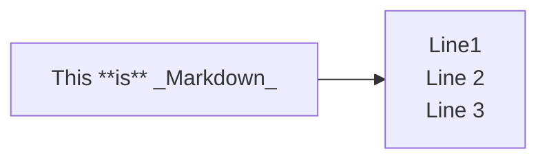
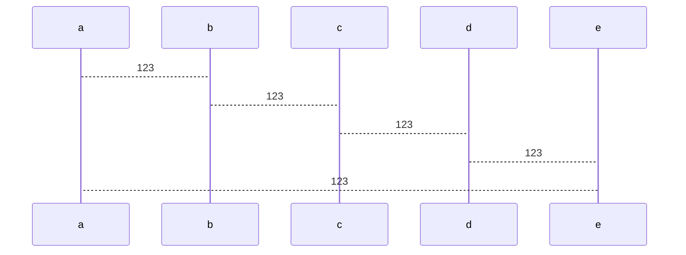

## HashSet

> HaspSet底层就是调用HashMap
>
> 数组+(单向)链表+红黑树
>
> 初始容量16，加载因子0.75，临界值12，第一次add才实例化数组
>
> 大于临界值才会扩容因为添加元素后才进行判断`if (++size > threshold)`;第一次扩容是在添加第13个元素的时候
>
> 2倍扩容，尾插法
>
> 线程不安全，存放无序，key和value可以是null




### 成员变量

```java
private transient HashMap<E,Object> map;

private static final Object PRESENT = new Object();
```

就两个字段，`map`就是**HashMap**，`PRESENT`是一个**new Object**，当作**value**来使用

### 构造方法

`Set set = new HashSet();`时执行此方法

```java
public HashSet() {
    map = new HashMap<>();
}
```

调用HashMap的无参构造，加载因子为默认的加载因子*0.75*

```java
public HashMap() {
    this.loadFactor = DEFAULT_LOAD_FACTOR; 
}
```

### add方法

`set.add("tom");`

调用map的`put()`方法，传入参数为e(即"tom")

```java
public boolean add(E e) {
    return map.put(e, PRESENT)==null;
}
```

`put()`方法再调用`putVal()`方法

```java
public V put(K key, V value) {
    return putVal(hash(key), key, value, false, true);
}
```

如果key为null就直接返回0，否则进行计算( *key的哈希值* 和 *key的哈希值进行无符号右移16位* 进行 *异或* 运算)并返回结果

```java
static final int hash(Object key) {
    int h;
    return (key == null) ? 0 : (h = key.hashCode()) ^ (h >>> 16);
}
```

到这里才是真正的添加操作，传入刚计算后的值，key即传入的参数("tom")，value固定为PRESENT(new Object())，onlyIfAbsent如果为真，则不更改现有值，evict 如果为 false，则表处于创建模式

```java
final V putVal(int hash, K key, V value, boolean onlyIfAbsent,
               boolean evict) {
    // 定义辅助变量,后面用到
    Node<K,V>[] tab; Node<K,V> p; int n, i;
    // 判断数组是否为null或者数组的长度是否为0
    // 如果结果为true就进行扩容
    // 此时tab即为数组，n即为数组长度
    if ((tab = table) == null || (n = tab.length) == 0)
        n = (tab = resize()).length;
    // (n - 1) & hash 为计算当前元素的索引，并将结果赋值给i
    // 将索引对应的元素(可能为null)赋值给p
    // 如果索引对应的位置为null就直接将元素添加到此位置
    if ((p = tab[i = (n - 1) & hash]) == null)
        tab[i] = newNode(hash, key, value, null);
    else {// 能够执行到这里说明数组不为null且tab[i]上存在元素
        // 定义辅助变量,后面用到
        Node<K,V> e; K k;
        // 判断tab[i]上的第一个节点的hash和key是否相等
        // 	如果p的hash(原来位置的hash)和传入的hash相同 并且满足 p的key和传入的key相同(同一地址) 或 p的key和传入key相等(比较内容；对象比较)
        // 	就将p赋值给e
        if (p.hash == hash &&
            ((k = p.key) == key || (key != null && key.equals(k))))
            e = p;
        // hash和key都不相等，判断是否是一颗红黑树
        else if (p instanceof TreeNode)
            // 如果是就执行红黑树的添加方法
            e = ((TreeNode<K,V>)p).putTreeVal(this, tab, hash, key, value);
        else {// 说明hash和key都不相等，也不是红黑树
            // 遍历整个链表，写的是个死循环，通过判断使用break退出
            for (int binCount = 0; ; ++binCount) {
                // 如果p的下一个节点为null，说明为最后一个节点，直接再末尾添加即可
                if ((e = p.next) == null) {
                    // 直接new一个节点并赋值给p.next
                    p.next = newNode(hash, key, value, null);
                    // TREEIFY_THRESHOLD 树化阈值 8
                    // 如果bincount >= 8-1 ==> bincount >= 7 ==> 
                    // 由于遍历是从p.next开始，p在一开就拿去做判断了，所以是从第二个节点开始的遍历，如果按bincount计算节点个数应该+1
                    // 还有，这个判断(是否树化)是再添加节点之后的，所以再+1
                    // 如果bincount此时为7,节点数量就是7+1+1 ==>9
                    if (binCount >= TREEIFY_THRESHOLD - 1)
                        /*
                        	树化，但是在树化之前还会判断数组长度是否<64,如果为true就扩容;所以真正树化需要链表长度>8且数组长度>=64
                            if (tab == null || (n = tab.length) < MIN_TREEIFY_CAPACITY)
                                resize();
                        */
                        treeifyBin(tab, hash);
                    // 此时添加节点完成，结束死循环
                    break;
                }
                // 执行到这里说明p.next不为null，不是最后一个节点
                // 判断每个节点和传入的元素的hash和key是否相等
                if (e.hash == hash &&
                    ((k = e.key) == key || (key != null && key.equals(k))))
                    // 相等，结束死循环
                    break;
                // e即p.next(p的下一个节点),将p指向e(此时p就是p.next),依次循环达到遍历的目的
                p = e;
            }
        }
        // 这里就是找到了和传入值相同的hash和key的元素，进行value替换        
        if (e != null) {
            // 获取旧值赋值给oldValue
            V oldValue = e.value;
            // onlyIfAbsent传入时为false取反即为true
            if (!onlyIfAbsent || oldValue == null)
                // 数组中对应的元素的value进行替换
                e.value = value;
            // 节点访问后，回调以允许LinkedHashMap后操作，方法内容为空
            afterNodeAccess(e);
            // 返回旧值，就不执行下面的代码
            return oldValue;
        }
    }
    // 修改次数+1，添加和删除时+1，更新替换不+1
    ++modCount;
    // 添加完后的元素数量(这里size是元素数量，不是实际占用数组长度)是否大于临界值，true就扩容(2倍扩容)
    if (++size > threshold)
        resize();
    // 节点插入后，回调以允许LinkedHashMap后操作，方法内容为空
    afterNodeInsertion(evict);
    // 添加成功返回null
    return null;
}
```

### 扩容

新容量=旧容量左右一位，相当于旧容量*2

```java
newCap = oldCap << 1
```


### 链表转红黑树

+ 新建一个测试类，全参构造，重写hashcode方法，使其返回固定值，以便测试

  ```java
  class Test {
      int i;
  
      public Test(int i) {
          this.i = i;
      }
  
      @Override
      public int hashCode() {
          return 1;
      }
  }
  ```

+ ```java
  public static void main(String[] args) {
      Set set = new HashSet();
      for (int i = 0; i < 20; i++) {
          set.add(new Test(i));
      }
  }
  ```

+ 打断点测试

  + 第1次执行`add()`方法会初始化一个*16*位的数组`table[]`，**加载因子**为*0.75*，**临界值**为 **数组长度**\***加载因子**=*12*
  + 固定hashcode为1进行`hash()`计算后*索引*在1，*key*为i即0，*value*固定为`PERSENT`，*next*为`null`
  + 第2次执行`add()`方法，由于固定hashcode计算的*索引*也是1，*key*为i即1，*value*也是固定的`PERSENT`，*next*为`null`，上一个节点的`next`指向此节点
  + 执行*8*次`add()`方法，此时仍是链表，长度为*8*，当进行第*9*次添加时，由于达到了树化条件(链表长度>=*9*)`binCount >= TREEIFY_THRESHOLD - 1`，尝试进行树化，但是此时数组长度为*16*，为达到*64*，进行2倍扩容，扩容长度至*32*
  + 再次(第*10*次)执行`add()`方法，仍然尝试树化，但是还是不满足，继续扩容，长度至*64*
  + 第*11*次执行`add()`方法，此时链表长度为11(先添加再树化)，数组长度为64，条件都满足成功树化


### 测试题

```java
public static void main(String[] args) {
    HashSet<Object> hashSet = new HashSet<>();
    Person a = new Person(1, "aaa");
    Person b = new Person(2, "bbb");
    hashSet.add(a);
    hashSet.add(b);
    // 修改a的name，由于hashset引用了a，所以hashset上的a也发生了改变
    a.setName("ccc");
    // remove方法会根据传入的key寻找对应的索引，由于传入的是ccc,寻找ccc对应的索引
    // 但是a最开始的索引是根据aaa建立的，所以不一致，remove失败
    hashSet.remove(a);
    // 依然输入2个对象
    System.out.println("removed>>>"+hashSet);
    // 添加ccc 根据传入的key建立对应的索引，由于a是根据aaa建立的索引，ccc可以添加成功
    hashSet.add(new Person(1, "ccc"));
    // 输出3个对象
    System.out.println("add 1 ccc>>>"+hashSet);
    // 添加aaa 传入的是aaa 就是a的索引位置，但是a的内容发生改变了，所以可以添加进入
    hashSet.add(new Person(1, "aaa"));
    // 输出4个对象
    System.out.println(hashSet);
}
```


## LinkedHashSet 

### 先说结论

> 数组+(双向)链表
>
> 顺序输出


## TreeSet

### 先说结论

> 实际上就是TreeMap
> 通过比较器实现取出有序
>
> 可通过有参构造传入自定义比较器，如果比较结果为0(会返回旧值，进行判断是否为null，为null添加成功)就添加失败，
>
> 
>
> 有参构造传入`Comparator`接口的实现类，调用`compare`方法用来比较它的两个参数的顺序。 当第一个参数小于、等于或大于第二个参数时，返回一个负整数、零或正整数
> 无参构造将使用key的`Comparable`接口的`compareTo`方法，如果传入key未实现Comparable接口将抛出异常


 


## HashTable

### 先说结论

> 数组+(单项)链表
>
> 初始容量11，加载因子0.75，临界值8，创建时就实例化数组
>
> 大于临界值才会扩容因为添加元素时先判断`if (count >= threshold)`，再去`count++` ;第一次扩容是在添加第9个元素的时候
>
> 头插法，2倍扩容+1
>
> 加了synchronized，线程安全，存放无序，key和value不能为null

### 成员变量

```java
private transient Entry<?,?>[] table; // Entry数组存放数据
private transient int count; // 数组中的元素大小
private int threshold; // 临界值
private float loadFactor; // 加载因子
private transient int modCount = 0; // hashtable被修改的次数
```

```java
private static class Entry<K,V> implements Map.Entry<K,V> {
    final int hash;
    final K key;
    V value;
    Entry<K,V> next;
    ...
}
```

### 无参构造

无参构造默认初始容量为11，加载因子为0.75

```java
public Hashtable() {
    this(11, 0.75f);
}
```

```java
public Hashtable(int initialCapacity, float loadFactor) {
    if (initialCapacity < 0)
        throw new IllegalArgumentException("Illegal Capacity: "+
                                           initialCapacity);
    if (loadFactor <= 0 || Float.isNaN(loadFactor))
        throw new IllegalArgumentException("Illegal Load: "+loadFactor);

    if (initialCapacity==0)
        initialCapacity = 1;
    this.loadFactor = loadFactor;
    // 执行完构造方法就初始化一个容量为11的数组
    table = new Entry<?,?>[initialCapacity];
    threshold = (int)Math.min(initialCapacity * loadFactor, MAX_ARRAY_SIZE + 1);
}
```

### put方法

```java
public synchronized V put(K key, V value) {
    /*
    * 这里写的value不能为null，但是后面还有key的hashcode这个也不能为null
    * 即hashtable的key和value都不能存放null
    **/
    if (value == null) {
        throw new NullPointerException();
    }

    // 将当前数组赋值给tab
    Entry<?,?> tab[] = table;
    // 获取key的哈希值
    int hash = key.hashCode();
    /*
    * 将哈希值和0x7FFFFFFF(‭01111111 11111111 11111111 11111111‬) 进行与运算，
    * 运算后的结果和数组长度取余，返回的最终结果就是该key在数组中的索引
    **/
    int index = (hash & 0x7FFFFFFF) % tab.length;
    // 抑制警告
    @SuppressWarnings("unchecked")
    // 获取此索引位置上的元素
    Entry<K,V> entry = (Entry<K,V>)tab[index];
    // 如果为null就跳过判断，直接执行下面的添加元素方法
    /*
    * 判断要插入索引位置的key是否和传入的key一致，插入位置的元素可能不止一个元素(链表)，如果不一致就一直判断直到下一个元素为null
    * 如果一致就进行值替换，并返回旧值
    **/
    for(; entry != null ; entry = entry.next) {
        if ((entry.hash == hash) && entry.key.equals(key)) {
            V old = entry.value;
            entry.value = value;
            return old;
        }
    }
	// 添加元素
    addEntry(hash, key, value, index);
    return null;
}
```

```java
private void addEntry(int hash, K key, V value, int index) {
    // 修改次数+1
    modCount++;

    // 将数组赋值给tab
    Entry<?,?> tab[] = table;
    // 添加前先判断元素个数是否>=临界值
    if (count >= threshold) {
        // 扩容
        rehash();
		// 将tab指向扩容后的数组
        tab = table;
        hash = key.hashCode();
        // 由于扩容，数组长度变化了，需要重新计算索引
        index = (hash & 0x7FFFFFFF) % tab.length;
    }

    @SuppressWarnings("unchecked")
    // 获取要插入位置的元素
    Entry<K,V> e = (Entry<K,V>) tab[index];
    // 头插法 新建一个Entry类 传入hash值，key，valeu，e(要插入位置的元素)
    tab[index] = new Entry<>(hash, key, value, e);
    // 元素个数+1
    count++;
}
```

### 扩容

```java
protected void rehash() {
    // 旧数组容量
    int oldCapacity = table.length;
    // 旧数组
    Entry<?,?>[] oldMap = table;

    // 新数组容量就是旧数组容量左右1位+1(即*2+1)
    int newCapacity = (oldCapacity << 1) + 1;
    // 如果新容量比最大长度还大 新容量就是数组最大容量
    if (newCapacity - MAX_ARRAY_SIZE > 0) {
        // 如果旧容量就是数组最大长度就使用旧数组容量(即数组的最大容量)
        if (oldCapacity == MAX_ARRAY_SIZE)
            return;

        newCapacity = MAX_ARRAY_SIZE;
    }
    // 新建一个新容量的数组
    Entry<?,?>[] newMap = new Entry<?,?>[newCapacity];
	
    // 修改次数+1
    modCount++;
    // 临界值为 新容量*负载因子 和 最大容量+1 区区中较小的值
    threshold = (int)Math.min(newCapacity * loadFactor, MAX_ARRAY_SIZE + 1);
    // table成功扩容，但是还需要将元素写入新数组
    table = newMap;
	
    // 遍历旧数组取出每个索引上的元素(链表)
    for (int i = oldCapacity ; i-- > 0 ;) {
        // 将索引上不为null的元素转为链表
        for (Entry<K,V> old = (Entry<K,V>)oldMap[i] ; old != null ; ) {
            // 当前索引(旧数组)上的元素(链表)
            Entry<K,V> e = old;
            // 链表(旧数组)的下一个节点
            old = old.next;
            // 计算元素在新数组中的索引
            int index = (e.hash & 0x7FFFFFFF) % newCapacity;
            // 头插法，将旧(数组)元素的下一个节点指向在新数组的索引位置上的元素
            e.next = (Entry<K,V>)newMap[index];
            // 使用旧元素(由于新索引位置上的元素都在next插入了)替换新元素
            newMap[index] = e;
        }
    }
}
```


## ConcurrentHashMap

### 成员变量

```java
// 存放元素的数组
transient volatile Node<K,V>[] table;
// 扩容时要使用的下一数组
private transient volatile Node<K,V>[] nextTable;
/*
* 表初始化和调整大小控制。
* 如果为负，则表正在初始化或调整大小：
* 	-1 表示初始化，
*	否则 -（1 + n）扩容线程的数量。
* 否则，当 table 为 null 时，保存创建时使用的初始表大小，或默认为 0。
* 初始化后，保存下一个要调整表格大小的元素计数值
**/
private transient volatile int sizeCtl;
// 默认容量
private static final int DEFAULT_CAPACITY = 16;
// 数组最大长度
static final int MAX_ARRAY_SIZE = Integer.MAX_VALUE - 8;
// 默认加载因子
private static final float LOAD_FACTOR = 0.75f;
// 树化阈值
static final int TREEIFY_THRESHOLD = 8;
// 数退化为链表的阈值
static final int UNTREEIFY_THRESHOLD = 6;
// 链表转为树 链表的最小容量
static final int MIN_TREEIFY_CAPACITY = 64;
// 多线程转移元素时，每个线程帮忙专业的最小容量
private static final int MIN_TRANSFER_STRIDE = 16;

// 运行时计算机的cpu线程数
static final int NCPU = Runtime.getRuntime().availableProcessors();
```


### 无参构造

```java
ConcurrentHashMap<Object, Object> map = new ConcurrentHashMap<>();

// 什么都不做，第一次添加元素时初始化数组，默认为16
public ConcurrentHashMap() {
}
```


### put方法

```java
public V put(K key, V value) {
    return putVal(key, value, false);
}
```

```java
final V putVal(K key, V value, boolean onlyIfAbsent) {
    // key和value都不允许为null
    if (key == null || value == null) throw new NullPointerException();
    /*
    * return (h ^ (h >>> 16)) & HASH_BITS; 0x7fffffff
    * 哈希值进行无符号由于16位 再与 哈希值进行 异或 再与上 0x7fffffff(‭01111111 11111111 11111111 11111111) 得到的结果赋值给hash
    * 由于最后与上的0x7fffffff 最高位是0，只有2个数都为1结果才为1，所以最高位结果一定位0 就是正数
    * 扰动函数
    **/
    int hash = spread(key.hashCode());
    int binCount = 0;
    // 死循环，将数组赋值给tab
    for (Node<K,V>[] tab = table;;) {
        Node<K,V> f; int n, i, fh;
        // 判断数组是否为空
        if (tab == null || (n = tab.length) == 0)
            // 初始化数组 由于是死循环这个if没有break，if else只会执行一个，再次进入for循环
            tab = initTable();
        // 判断索引为i = (n - 1) & hash 的位置上的元素f是否为null
        else if ((f = tabAt(tab, i = (n - 1) & hash)) == null) {
            // 为null就直接在索引为i的位置上进行添加
            if (casTabAt(tab, i, null,
                         new Node<K,V>(hash, key, value, null)))
                break;                   // no lock when adding to empty bin
        }
        // 如果fh(f的hash)是 MOVED -1，表明正在进行扩容，就帮助扩容
        else if ((fh = f.hash) == MOVED)
            tab = helpTransfer(tab, f);
        else {
            // 要添加位置上的元素不为null，数组也没有进行扩容
            V oldVal = null;
            // 给要添加位置上的元素进行上锁
            synchronized (f) {
                // 再次判断是否为同一个元素
                if (tabAt(tab, i) == f) {
                    // 判断是否为>=0,true即为链表
                    if (fh >= 0) {
                        binCount = 1;
                        // 将链表赋值给e，没循环一次bincount就+1
                        for (Node<K,V> e = f;; ++binCount) {
                            K ek;
                            // 判断e的hash是否和传入的hash相等 且 e的key和传入的key一致或相等
                            if (e.hash == hash &&
                                ((ek = e.key) == key ||
                                 (ek != null && key.equals(ek)))) {
                                oldVal = e.val;
                                if (!onlyIfAbsent)
                                    // 值替换
                                    e.val = value;
                                break;
                            }
                            // 将e赋值给pred
                            Node<K,V> pred = e;
                            // e执行e的下一个节点，pred此时相当于e的上一个节点
                            if ((e = e.next) == null) {
                                // 如果e的下一个节点为null，就直接在e后面添加
                                pred.next = new Node<K,V>(hash, key,
                                                          value, null);
                                break;
                            }
                        }
                    }
                    // 判断是否为树 执行对应的树添加操作
                    else if (f instanceof TreeBin) {
                        Node<K,V> p;
                        binCount = 2;
                        if ((p = ((TreeBin<K,V>)f).putTreeVal(hash, key,
                                                       value)) != null) {
                            oldVal = p.val;
                            if (!onlyIfAbsent)
                                p.val = value;
                        }
                    }
                }
            }
            if (binCount != 0) {
                // 判断链表长度 是否>= 树化阈值
                if (binCount >= TREEIFY_THRESHOLD)
                    // 执行树化操作，实际树化前会判断数组长度是否>= 64，true树化，false扩容
                    // if ((n = tab.length) < MIN_TREEIFY_CAPACITY) tryPresize(n << 1);
                    treeifyBin(tab, i);
                if (oldVal != null)
                    // 返回旧值(b)
                    return oldVal;
                break;
            }
        }
    }
    addCount(1L, binCount);
    return null;
}
```

```java
private final Node<K,V>[] initTable() {
    Node<K,V>[] tab; int sc;
    // 将数组赋值给tab，判断是否为空
    while ((tab = table) == null || tab.length == 0) {
        // 将sizeCtl赋值给sc，判断是否小于0
        if ((sc = sizeCtl) < 0)
            // 小于0说明其他线程正在进行初始化
            // 将cpu执行权让出去，让其他线程使用
            Thread.yield(); // lost initialization race; just spin
        // cas将sizeCatl的值改为-1，修改成功进行初始化，修改失败，自旋
        else if (U.compareAndSwapInt(this, SIZECTL, sc, -1)) {
            try {
                // 双重检查，防止其他线程重复初始化
                if ((tab = table) == null || tab.length == 0) {
                    // 判断sc是否大于0，由于(sc = sizeCtl)最开始为0，所以n为默认容量16
                    int n = (sc > 0) ? sc : DEFAULT_CAPACITY;
                    @SuppressWarnings("unchecked")
                    // 初始化容量为n的数组
                    Node<K,V>[] nt = (Node<K,V>[])new Node<?,?>[n];
                    // 将数组赋值给table
                    table = tab = nt;
                    // (n >>> 2)减少n的2次方16-4 相当于n*0.75
                    sc = n - (n >>> 2);
                }
            } finally {
                // 将阈值赋值给sizeCtl
                sizeCtl = sc;
            }
            break;
        }
    }
    return tab;
}
```

```java
private final void addCount(long x, int check) {
    CounterCell[] as; long b, s;
    if ((as = counterCells) != null ||
        !U.compareAndSwapLong(this, BASECOUNT, b = baseCount, s = b + x)) {
        CounterCell a; long v; int m;
        boolean uncontended = true;
        if (as == null || (m = as.length - 1) < 0 ||
            (a = as[ThreadLocalRandom.getProbe() & m]) == null ||
            !(uncontended =
              U.compareAndSwapLong(a, CELLVALUE, v = a.value, v + x))) {
            fullAddCount(x, uncontended);
            return;
        }
        if (check <= 1)
            return;
        s = sumCount();
    }
    if (check >= 0) {
        Node<K,V>[] tab, nt; int n, sc;
        while (s >= (long)(sc = sizeCtl) && (tab = table) != null &&
               (n = tab.length) < MAXIMUM_CAPACITY) {
            int rs = resizeStamp(n);
            if (sc < 0) {
                if ((sc >>> RESIZE_STAMP_SHIFT) != rs || sc == rs + 1 ||
                    sc == rs + MAX_RESIZERS || (nt = nextTable) == null ||
                    transferIndex <= 0)
                    break;
                if (U.compareAndSwapInt(this, SIZECTL, sc, sc + 1))
                    transfer(tab, nt);
            }
            else if (U.compareAndSwapInt(this, SIZECTL, sc,
                                         (rs << RESIZE_STAMP_SHIFT) + 2))
                transfer(tab, null);
            s = sumCount();
        }
    }
}
```
